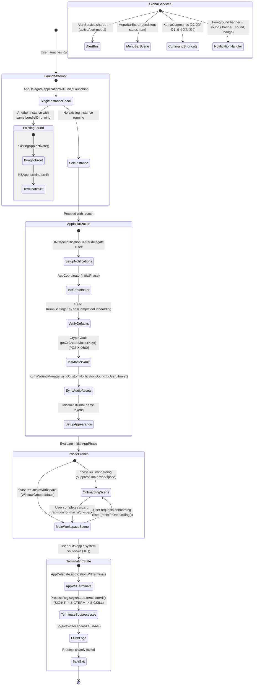

# Feature Spec 00: App Foundation & Lifecycle

> **Status:** Active / Locked  
> **Target Version:** macOS 14+ (SwiftUI, Swift 6 Concurrency)  
> **Source Files:**  
> - `SingleInstanceGuard.swift`  
> - `AppDelegate.swift`  
> - `AppCoordinator.swift`  
> - `KumaApp.swift`  
> - `KumaCommands.swift`  
> - `CryptoVault.swift`  
> - `AlertService.swift`  
> - `KumaSoundManager.swift`  
> - `KumaTheme.swift`  
> - `ProcessRegistry.swift`  
> - `LogFileWriter.swift`  
> **Test Suite Target:** `KumaTests/Features/App/` (`SingleInstanceGuardTests.swift`, `AppCoordinatorTests.swift`, `CryptoVaultTests.swift`, `AlertServiceTests.swift`, `KumaSoundManagerTests.swift`, `LifecycleTeardownTests.swift`, `KumaCommandsTests.swift`, `AppThemeAndNotificationTests.swift`)

---

## 1. High-Level Flow (Mermaid Diagram)

---

## 2. Deterministic State & Transition Matrix

| Current State / Phase | Event / Input | Next State / Phase | Persistence / System Side Effects | Invariant Guardrails |
| :--- | :--- | :--- | :--- | :--- |
| **Pre-Launch** | Binary executed | **SingleInstanceCheck** | Inspect `NSRunningApplication.runningApplications(withBundleIdentifier:)`. Filter out current PID and skip in unit tests. | `[INV-APP-01]` |
| **SingleInstanceCheck** | Duplicate detected (`count > 1`) | **Terminated** | `existingApp.activate()`, `NSApp.terminate(nil)`. New process stops before UI initialization. | `[INV-APP-01]` |
| **SingleInstanceCheck** | Sole instance (`count == 1`) | **Initializing** | Proceed to `applicationDidFinishLaunching`. Register notification center delegate. | `[INV-APP-01]` |
| **Initializing** | Read onboarding key | **Phase Determined** | Check `UserDefaults` key `kuma.has_completed_onboarding`. If `true` $\to$ `.mainWorkspace`, else $\to$ `.onboarding`. | `[INV-APP-02]` |
| **Initializing** | Vault master key check | **Vault Ready** | Access `~/Library/Application Support/Kuma/master.key`. Create directory (`0700`) and key file (`0600`) if absent. | `[INV-APP-05]` |
| **Initializing** | Audio sound setup | **Audio Ready** | Copy `kuma-alert.caf` to `~/Library/Sounds/` if not present. Skip redundant disk write if destination exists. | `[INV-APP-06]` |
| **Initializing** | Notification delegate setup | **Notifications Ready** | Assign `AppDelegate` as `UNUserNotificationCenter.delegate`. | `[INV-APP-09]` |
| **Phase: .onboarding** | Wizard finished / `transitionTo(.mainWorkspace)` | **Phase: .mainWorkspace** | Persist `kuma.has_completed_onboarding = true`. Open main window scene, dismiss onboarding window. | `[INV-APP-02]` |
| **Phase: .mainWorkspace** | Reset requested (`resetToOnboarding()`) | **Phase: .onboarding** | Persist `kuma.has_completed_onboarding = false`. Re-open onboarding scene. | `[INV-APP-02]` |
| **Runtime Any** | Error or confirmation emitted | **Alert Active** | `AlertService.shared.presentAlert(...)`. Triggers `@Observable` alert presentation on active window. | `[INV-APP-04]` |
| **Runtime Any** | User confirms / dismisses alert | **Alert Inactive** | `activeAlert` set back to `nil`. Button closure callback invoked on `@MainActor`. | `[INV-APP-04]` |
| **Runtime Any** | Notification sound triggered | **Audio Played** | `KumaSoundManager.shared.playNotificationSound()`. Plays `kuma-alert.caf` at ~45% volume. Fallback to `NSSound.beep()`. | `[INV-APP-06]` |
| **Runtime Any** | Notification delivered in foreground | **Banner & Sound Presented** | Delegate returns presentation options `[.banner, .sound, .badge]`. | `[INV-APP-09]` |
| **Runtime Any** | Appearance mode changed | **Theme Updated** | Apply color tokens dynamically across scenes without view hierarchy reconstructs. | `[INV-APP-08]` |
| **Runtime Any** | App quit requested (`NSApplication.terminate` / ⌘Q) | **Terminating** | `applicationWillTerminate` invoked. Triggers asynchronous cleanup task. | `[INV-APP-03]` |
| **Terminating** | Subprocess cleanup | **Subprocesses Killed** | Call `ProcessRegistry.shared.terminateAll()`. Escalate `SIGINT` $\to$ `SIGTERM` $\to$ `SIGKILL` to prevent orphan daemons. | `[INV-APP-03]` |
| **Terminating** | Log buffer cleanup | **Exited Cleanly** | Call `LogFileWriter.shared.flushAll()`. Close open file handles. Terminate host process. | `[INV-APP-03]` |

---

## 3. Invariant Rules (Kontrak Baku - Non-Negotiables)

1. **`[INV-APP-01]` Strict Single-Instance Execution**: Kuma tidak boleh berjalan lebih dari satu instance di satu user session macOS. Jika instance kedua diluncurkan, instance aktif harus di-bring to front dan instance baru keluar (`terminate`) seketika. Pemeriksaan ini **wajib dilewati (bypass)** jika berjalan di bawah environment unit test (`XCTestConfigurationFilePath != nil` / `NSClassFromString("XCTestCase") != nil`).
2. **`[INV-APP-02]` Deterministic Phase Transitions & Storage Integrity**: Transisi `AppCoordinator` antara `.onboarding` dan `.mainWorkspace` wajib sinkron secara atomik dengan `KumaSettingsKey.hasCompletedOnboarding`. Tidak boleh ada ambiguitas fase ketika storage kosong atau rusak (wajib fallback ke `.onboarding`).
3. **`[INV-APP-03]` Zero-Orphan Subprocess Termination**: Saat aplikasi ditutup (`applicationWillTerminate`), Kuma wajib mematikan seluruh subproses yang terdaftar di `ProcessRegistry` menggunakan eskalasi sinyal POSIX (`SIGINT` $\to$ `SIGTERM` $\to$ `SIGKILL`) serta mem-flush semua buffer log di `LogFileWriter`. Tidak boleh ada child process yang tertinggal sebagai zombie/orphan.
4. **`[INV-APP-04]` Thread-Safe Global Alert Bus**: `AlertService` wajib terisolasi ke `@MainActor` dan reactive via Swift Observation (`@Observable`). Alert aktif hanya boleh ada satu pada satu waktu (`single-slot modal`), dan dismiss wajib me-reset `activeAlert` kembali ke `nil`.
5. **`[INV-APP-05]` Master Key Security & POSIX Permission Lockdown**: `CryptoVault` wajib mengamankan file kunci simetris AES-256 (`master.key`) dengan atribut permission POSIX `0600` (hanya owner read/write) dan direktori penampungnya dengan `0700`. Enkripsi wajib menggunakan format terotentikasi `nonce:tag:ciphertext`.
6. **`[INV-APP-06]` Idempotent Audio Asset Synchronization**: Pengecekan file audio sistem `kuma-alert.caf` ke `~/Library/Sounds/` wajib bersifat idempoten: jika file sudah ada di folder tujuan, sistem tidak boleh melakukan operasi penulisan disk ulang saat app startup. Volume playback dibatasi aman pada ~45%.
7. **`[INV-APP-07]` Menu Command & Shortcut HIG Compliance**: Global menu commands (`KumaCommands`) wajib mematuhi standar keyboard shortcut macOS (Preferences `⌘,`, Find `⌘F`, Workspace switching `⌘1`..`⌘9`, New Workspace `⇧⌘N`, Onboarding Help `⌘?`).
8. **`[INV-APP-08]` Dynamic Design System & Color Tokens**: Token visual pada `KumaTheme` wajib adaptif dan stabil di semua container (Window, Popover, MenuBarExtra) tanpa me-reset state internal view saat appearance mode berubah.
9. **`[INV-APP-09]` Foreground Notification Delivery Contract**: Delegate notifikasi lokal wajib menyajikan banner, suara, dan badge (`[.banner, .sound, .badge]`) bahkan ketika jendela aplikasi sedang aktif/fokus, agar user tidak kehilangan peringatan penting mengenai lifecycle servis.

---

## 4. Invariant Guardrails Mapping ke Target Test Suite

| Invariant ID | Skenario Pengujian Kunci | Target Test Suite |
| :--- | :--- | :--- |
| **`[INV-APP-01]`** | Single instance detection, mock secondary PID activation, unit test bypass flag | `KumaTests/Features/App/SingleInstanceGuardTests.swift` |
| **`[INV-APP-02]`** | Phase initial state, transition atomicity, defaults fallback, reset trigger | `KumaTests/Features/App/AppCoordinatorTests.swift` |
| **`[INV-APP-03]`** | Terminate all processes on app exit, signal escalation, log flush on terminate | `KumaTests/Features/App/LifecycleTeardownTests.swift` |
| **`[INV-APP-04]`** | Alert payload delivery, custom action closures, single-slot replacement, dismiss reset | `KumaTests/Features/App/AlertServiceTests.swift` |
| **`[INV-APP-05]`** | Master key generation, POSIX 0600/0700 file permission, AES-256-GCM encrypt/decrypt, corrupted payload rejection | `KumaTests/Features/App/CryptoVaultTests.swift` |
| **`[INV-APP-06]`** | Sound asset sync to Library/Sounds, idempotent skip on existing file, volume limit, sound playback | `KumaTests/Features/App/KumaSoundManagerTests.swift` |
| **`[INV-APP-07]`** | KumaCommands shortcut binding, menu item actions firing notifications | `KumaTests/Features/App/KumaCommandsTests.swift` |
| **`[INV-APP-08]`** | KumaTheme token validity, dark/light contrast compliance | `KumaTests/Features/App/AppThemeAndNotificationTests.swift` |
| **`[INV-APP-09]`** | UNNotificationCenter foreground presentation options verification | `KumaTests/Features/App/AppThemeAndNotificationTests.swift` |
