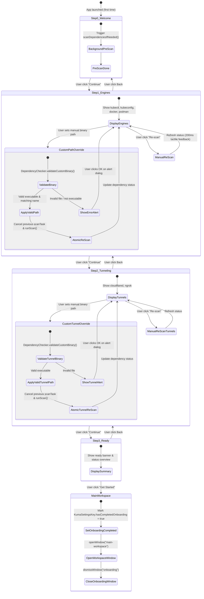

# Feature Spec 01: Onboarding Wizard & System Dependency Check

> **Status:** Active / Locked  
> **Target Version:** macOS 14+ (SwiftUI, Swift 6 Concurrency)  
> **Source Files:**  
> - `OnboardingViewModel.swift`  
> - `OnboardingWizardView.swift`  
> - `ContainersAndClustersStepView.swift`  
> - `PublicTunnelingStepView.swift`  
> - `DependencyChecker.swift`  
> - `KumaSettingsKey.swift`  
> **Test Suite Target:** `KumaTests/Features/Onboarding/` (`OnboardingInitialStateTests.swift`, `OnboardingBinaryValidationTests.swift`, `OnboardingConcurrencyAndMappingTests.swift`, `OnboardingFlowTests.swift`, `OnboardingVisualTests.swift`)

---

## 1. High-Level Flow (Human Visual)

---

## 2. State & Transition Matrix (Machine Deterministic)

| Current Step | Event / Action | Next Step | Persistence Action | Side Effects / UI Behavior |
| :--- | :--- | :--- | :--- | :--- |
| `0 (Welcome)` | `onAppear` | `0` | None | Background async pre-scan triggered once (`hasInitialScanned = true`). |
| `0 (Welcome)` | `nextStep()` | `1 (Engines)` | None | Spring transition forward (`trailing -> leading`). |
| `1 (Engines)` | `prevStep()` | `0 (Welcome)` | None | Spring transition backward (`leading -> trailing`). |
| `1 (Engines)` | `setCustomPath(dep, path)` [Valid] | `1` | `UserDefaults` update for `dependency.settingsKey` (`KumaSettingsKey`) | Cancel previous in-flight scan task, trigger atomic re-scan. Detected binary renders trailing `✓ Ready` status; uninstalled renders `Browse…` button. |
| `1 (Engines)` | `setCustomPath(dep, path)` [Invalid] | `1` | **No Persistence** | Set `pathValidationError`, present native `.alert("Invalid Binary Selection")`. |
| `1 (Engines)` | `runScan(force: true)` | `1` | None | Set `isScanning = true`, 200ms haptic throttle, refresh `engineDependencies`. |
| `1 (Engines)` | `nextStep()` | `2 (Tunneling)` | None | Spring transition forward. Allowed even if some dependencies are missing (non-blocking). |
| `2 (Tunneling)` | `prevStep()` | `1 (Engines)` | None | Spring transition backward. |
| `2 (Tunneling)` | `setCustomPath(dep, path)` [Valid] | `2` | `UserDefaults` update for `dependency.settingsKey` (`KumaSettingsKey`) | Cancel previous in-flight scan task, trigger atomic re-scan. Detected binary renders trailing `✓ Ready` status; uninstalled renders `Browse…` button. |
| `2 (Tunneling)` | `setCustomPath(dep, path)` [Invalid] | `2` | **No Persistence** | Set `pathValidationError`, present native `.alert("Invalid Binary Selection")`. |
| `2 (Tunneling)` | `nextStep()` | `3 (Ready)` | None | Spring transition forward. Button changes to "Get Started". |
| `3 (Ready)` | `prevStep()` | `2 (Tunneling)` | None | Spring transition backward. Button reverts to "Continue". |
| `3 (Ready)` | `completeOnboarding()` | Closed | `KumaSettingsKey.hasCompletedOnboarding = true` | Fire `onComplete?()`, transition `AppCoordinator`, open `main-workspace`, dismiss `onboarding`. |

---

## 3. Invariant Rules (Kontrak Baku - Tidak Boleh Dilanggar)

1. **[INV-ONB-01] Non-Blocking Progression**: User berhak melanjutkan wizard (`Continue` / `Get Started`) meskipun 0 dependency terinstall, karena user mungkin hanya ingin memakai Shell / SSH provider standar.
2. **[INV-ONB-02] No Double-Transition**: Transisi step harus debounce-safe dan dibatasi `canGoNext` & `canGoPrev` (`currentStep` wajib bounded antara `0` s/d `totalSteps - 1`).
3. **[INV-ONB-03] Atomic Path Re-scan (No Race Conditions)**: Pergantian custom path binary yang dilakukan cepat secara beruntun harus membatalkan (*cancel*) task scan sebelumnya, sehingga hasil scan terakhir selalu mencerminkan input path paling mutakhir.
4. **[INV-ONB-04] Idempotent Pre-scan**: Pre-scan di Step 0 hanya dieksekusi 1 kali saat wizard dibuka pertama kali, kecuali user secara eksplisit menekan tombol "Re-scan".
5. **[INV-ONB-05] Strict Binary Validation**: File yang dipilih via "Browse..." wajib divalidasi `isExecutable` dan name match. File invalid tidak boleh disimpan ke `UserDefaults` dan wajib memunculkan alert popover ke user.
6. **[INV-ONB-06] Clean Termination**: Menyelesaikan onboarding wajib menandai completion flag di persistence (`KumaSettingsKey.hasCompletedOnboarding`) dan menutup window onboarding secara bersih tanpa meninggalkan background polling task yang menggantung.

---

## 4. Test Contract Mapping (Invariant Guardrails)

Untuk daftar pengujian mendalam (40 Test Cases mencakup Edge Cases, Concurrency, Hardware/macOS Quirks, dan Visual UI), lihat dokumen terpisah:  
👉 [**`docs/testing/01-onboarding-test-matrix.md`**](file:///Users/putra/Development/Personal/Projects/Kuma/Repositories/Kuma/docs/testing/01-onboarding-test-matrix.md)

| Invariant ID | Test Name | Target File | Status |
| :--- | :--- | :--- | :--- |
| **INV-ONB-01** | `testZeroDependenciesProgression()` (TC-D01) | `Features/Onboarding/OnboardingConcurrencyAndMappingTests.swift` | ✅ Passed (0.003s) |
| **INV-ONB-02** | `testRapidStepForwardSpam()` & `testRapidStepBackwardSpam()` (TC-C03/04) | `Features/Onboarding/OnboardingConcurrencyAndMappingTests.swift` | ✅ Passed (0.002s) |
| **INV-ONB-03** | `testPathOverrideDuringScan()` & `testRapidConsecutiveScans()` (TC-C01/02) | `Features/Onboarding/OnboardingConcurrencyAndMappingTests.swift` | ✅ Passed (0.013s) |
| **INV-ONB-04** | `testIdempotentPreScan()` (TC-D04) | `Features/Onboarding/OnboardingConcurrencyAndMappingTests.swift` | ✅ Passed (0.001s) |
| **INV-ONB-05** | `testFileNotFoundRejection()`, `testNonExecutableFileRejection()` (TC-B01/03) | `Features/Onboarding/OnboardingBinaryValidationTests.swift` | ✅ Passed (0.003s) |
| **INV-ONB-06** | `testCompleteOnboardingLifecycle()` (TC-E01) | `Features/Onboarding/OnboardingFlowTests.swift` | ✅ Passed (0.003s) |
