# Feature Spec 02: Settings & Preferences

> **Status:** Active / Locked  
> **Target Version:** macOS 14+ (SwiftUI, Swift 6 Strict Concurrency)  
> **Source Files:**  
> - `Kuma/Presentation/Features/Settings/ViewModels/SettingsViewModel.swift`  
> - `Kuma/Presentation/Features/Settings/Views/SettingsView.swift`  
> - `Kuma/Presentation/Features/Settings/Views/Sections/SettingsGeneralSection.swift`  
> - `Kuma/Presentation/Features/Settings/Views/Sections/SettingsAppearanceSection.swift`  
> - `Kuma/Presentation/Features/Settings/Views/Sections/SettingsNotificationsSection.swift`  
> - `Kuma/Presentation/Features/Settings/Views/Sections/SettingsCLIToolsSection.swift`  
> - `Kuma/Presentation/Features/Settings/Views/Sections/SettingsTunnelingToolsSection.swift`  
> - `Kuma/Presentation/Features/Settings/Views/Sections/SettingsLogsSection.swift`  
> - `Kuma/Presentation/Features/Settings/Views/Sections/SettingsDataSection.swift`  
> - `Kuma/Presentation/Features/Settings/Views/Components/AppearanceCard.swift`  
> - `Kuma/Presentation/Features/Settings/Views/Components/BinaryStatusBadge.swift`  
> - `Kuma/Domain/Models/KumaSettingsKey.swift`  
> - `Kuma/Core/DataPort/DataPortService.swift`  
> **Test Suite Target:** `KumaTests/Features/Settings/`  
> - `SettingsInitialStateTests.swift` (Kategori A: Baseline Default Settings)  
> - `SettingsValidationAndSecurityTests.swift` (Kategori B: Validasi CLI & Tunneling Paths)  
> - `SettingsPersistenceAndSyncTests.swift` (Kategori C: UserDefaults Mutation & Legacy Key Fallback)  
> - `SettingsSystemIntegrationTests.swift` (Kategori D: Appearance & SMAppService Login Integration)  
> - `SettingsDataPortLifecycleTests.swift` (Kategori E: Export, Selective Import & Wipe Storage)  
> - `SettingsVisualTests.swift` (Kategori F: Sections Rendering & Accessibility HIG)

---

## 1. High-Level Flow (Architecture & State Flow)

```mermaid
graph TD
    User([User in Settings Screen]) --> Nav[SettingsView / ScrollView]
    
    subgraph AppPreferences [1. General & Appearance]
        Nav --> GeneralSec[SettingsGeneralSection]
        GeneralSec --> SMApp[SMAppService.mainApp Register / Unregister]
        GeneralSec --> AutoResume[Auto-Resume Services Toggle]
        GeneralSec --> ConfirmQuit[Confirm Before Quitting Toggle]
        
        Nav --> AppSec[SettingsAppearanceSection]
        AppSec --> AppCard[AppearanceCard: System / Light / Dark]
        AppCard --> NSAppTheme[NSApplication.appearance Mutation]
    end

    subgraph SystemAndTools [2. Engine, CLI & Tunnels]
        Nav --> CLISec[SettingsCLIToolsSection]
        CLISec --> KubeCLI[Kubectl & Kubeconfig Path]
        CLISec --> ContainerCLI[Docker & Podman Binary Path]
        CLISec --> ShellPicker[Default Shell: zsh / bash / fish]
        
        Nav --> TunnelSec[SettingsTunnelingToolsSection]
        TunnelSec --> Cloudflared[Cloudflared Binary Path]
        TunnelSec --> Ngrok[ngrok Binary Path]
        
        KubeCLI & ContainerCLI & Cloudflared & Ngrok --> DepCheck[DependencyChecker Zero-Latency Validation]
        DepCheck --> Badges[BinaryStatusBadge: Installed / Missing]
    end

    subgraph NotificationsAndLogs [3. Notifications & Buffer]
        Nav --> NotifSec[SettingsNotificationsSection]
        NotifSec --> CrashAlert[Notify on Crash]
        NotifSec --> UNPerm[UNUserNotificationCenter Auth Request]
        NotifSec --> HealthFail[Notify on Health Failure]
        NotifSec --> PortSafety[Port Collision Alerts]
        
        Nav --> LogSec[SettingsLogsSection]
        LogSec --> LogBuf[LogRetentionLimit: 10MB / 50MB / 100MB / Unlimited]
        LogSec --> ClearBuf[Clear Buffer on Restart Toggle]
    end

    subgraph DataManagement [4. Backup & Danger Zone]
        Nav --> DataSec[SettingsDataSection]
        DataSec --> ExportJSON[Export Kuma Backup JSON]
        ExportJSON --> DataPortEnc[DataPortService.encodeBackup Atomic File Write]
        
        DataSec --> ImportJSON[Import Kuma Backup JSON]
        ImportJSON --> SheetModal[ImportPreviewSheet Modal]
        SheetModal --> SelectiveRestore[DataPortRepository.importSelective]
        SelectiveRestore --> StoreReload[workspaceStore.loadFromDatabase]
        
        DataSec --> FactoryReset[Reset All Data Danger Zone]
        FactoryReset --> TermProc[ProcessRegistry.terminateAll]
        TermProc --> WipeDB[AppDatabase.wipeAndResetDatabase]
        WipeDB --> WipeDefaults[UserDefaults Domain Removal]
        WipeDefaults --> RelaunchCoord[coordinator.resetToOnboarding]
    end
```

---

## 2. Machine Deterministic State & Transition Matrix

| Setting Category / Control | Trigger / User Event | State / Property Affected | Underlying Persistence Key (`KumaSettingsKey` / `Keys`) | System / External Side Effect | Fallback / Guard Condition |
| :--- | :--- | :--- | :--- | :--- | :--- |
| **Launch at Login** | Toggle Switch | `launchAtLogin: Bool` | `kuma.settings.launchAtLogin` | `SMAppService.mainApp.register()` or `unregister()` | Log error on permission denial; does not crash |
| **Auto-Resume Services** | Toggle Switch | `autoResumeServices: Bool` | `kuma.settings.autoResumeServices` | Read during app boot in `WorkspaceStore` / startup flow | Default: `true` |
| **Confirm Before Quit** | Toggle Switch | `confirmBeforeQuit: Bool` | `kuma.settings.confirmBeforeQuit` | Intercepted in `AppDelegate.applicationShouldTerminate` | Default: `true` |
| **Appearance Theme** | Select Card (`system`/`light`/`dark`) | `appearance: KumaAppearance` | `kuma.settings.appearance` | `NSApp.appearance = nil` / `NSAppearance(named: .aqua)` / `.darkAqua` | Immediate zero-delay UI theme update |
| **Default Shell** | Select Picker Option | `defaultShell: String` | `kuma.settings.defaultShell` | Process executor spawns selected shell (`/bin/zsh`, `/bin/bash`, `/opt/homebrew/bin/fish`) | Default: `/bin/zsh` |
| **Kubectl Path** | Text Input / File Picker | `customKubectlPath: String` | `kuma.settings.customKubectlPath` | Evaluated against `DependencyChecker.validateCustomBinary` | Checks fallback `kuma.custom_kubectl_path` |
| **Kubeconfig Path** | Text Input / File Picker | `customKubeconfigPath: String` | `kuma.settings.customKubeconfigPath` | Evaluated against file existence & YAML structure | Checks fallback `kuma.custom_kubeconfig_path` |
| **Docker Binary Path** | Text Input / File Picker | `customDockerPath: String` | `kuma.settings.customDockerPath` | Evaluated against `DependencyChecker.validateCustomBinary` | Checks fallback `kuma.custom_docker_path` |
| **Podman Binary Path** | Text Input / File Picker | `customPodmanPath: String` | `kuma.settings.customPodmanPath` | Evaluated against `DependencyChecker.validateCustomBinary` | Checks fallback `kuma.custom_podman_path` |
| **Cloudflared Path** | Text Input / File Picker | `cloudflaredPath: String` | `kuma.settings.cloudflaredPath` | Evaluated against `DependencyChecker.validateCustomBinary` | Checks fallback `kuma.custom_cloudflared_path` |
| **ngrok Binary Path** | Text Input / File Picker | `customNgrokPath: String` | `kuma.settings.customNgrokPath` | Evaluated against `DependencyChecker.validateCustomBinary` | Checks fallback `kuma.custom_ngrok_path` |
| **Notify on Crash** | Toggle Switch | `notifyOnCrash: Bool` | `kuma.settings.notifyOnCrash` | Requests `UNUserNotificationCenter` authorization | Resets to `false` and alerts user if denied |
| **Notify on Health Fail**| Toggle Switch | `notifyOnHealthFailure: Bool`| `kuma.settings.notifyOnHealthFailure` | HealthCheck engine suppresses or dispatches alerts | Default: `true` |
| **Port Collision Safety**| Toggle Switch | `warnOnPortCollision: Bool` | `kuma.settings.warnOnPortCollision` | Pre-start check checks socket availability before process launch | Default: `true` |
| **Log Retention Buffer** | Select Picker Option | `logRetentionLimit: LogRetentionLimit` | `kuma.settings.logRetentionLimit` | Ring buffer ceiling for process log outputs (10MB, 50MB, 100MB, 0=unlimited) | Default: `50MB` |
| **Clear Buffer on Restart**| Toggle Switch | `clearLogsOnSwitch: Bool` | `kuma.settings.clearLogsOnSwitch` | Service restart handler purges in-memory log buffer | Default: `false` |
| **Export Configuration** | Click "Export…" Button | Modal NSSavePanel | None (Reads DB records) | Writes pretty-printed JSON file atomically | Disabled while `isProcessing == true` |
| **Import Configuration** | Click "Import…" Button / Drag JSON | Modal NSOpenPanel / Sheet | None (Parses JSON) | Opens `ImportPreviewSheet` with selective workspace & service restoration | Version verification (`backup.version <= currentVersion`) |
| **Reset All Data** | Confirm Dialog "Reset Everything" | Complete App Wipe | Clears UserDefaults, SQLite DB, Workspace Images | Calls `ProcessRegistry.shared.terminateAll()`, transitions to `.onboarding` | Protected by 2-step destructive confirmation dialog |

---

## 3. Invariant Rules (Kontrak Baku / Non-Negotiables)

1. **Unified Storage Keys (`KumaSettingsKey`)**:
   - Every single persistent key must be exposed in `KumaSettingsKey` with zero divergent string literals between `SettingsViewModel`, `OnboardingViewModel`, and engine services.
   - Backward compatibility: If modern key is absent, fallback legacy keys (`kuma.custom_*`) must be checked transparently.
2. **Swift 6 Strict Concurrency & Actor Isolation**:
   - `SettingsViewModel` must remain `@MainActor` isolated as it binds directly to SwiftUI FormKit controls.
   - All persistence mutations (`userDefaults.set(...)`) happen deterministically on property `didSet`.
   - Thread-safe access to `DataPortService`, `ProcessRegistry`, and `AppDatabase` must adhere to `@Sendable` boundaries.
3. **Atomic File Operations**:
   - Export backup files must be saved with atomic write options (`Data.write(to: url, options: .atomic)`).
   - Temporary file decoding must use modern non-deprecated URL methods (`.path(percentEncoded: false)`).
4. **Zero-Latency Path Validation**:
   - File picker changes must evaluate binary validity instantly via `DependencyChecker.validateCustomBinary()` without blocking the main UI thread.
   - Non-executable files, directory paths, and mismatched binary names must show red error badges and prevent faulty runtime execution.
5. **Safe Destructive Reset**:
   - Resetting app data must first terminate all active child processes (`ProcessRegistry.shared.terminateAll()`) with orphan killer escalation (`SIGINT` $\to$ `SIGTERM` $\to$ `SIGKILL`), then wipe SQLite and UserDefaults, and finally transition `AppCoordinator` safely to `.onboarding`.
   - `print()` is strictly forbidden in production code; all log outputs must use `os.Logger`.
6. **HIG Compliance & View Modularity**:
   - Views must adhere to `< 150` lines limit. Sub-sections and preview cards must remain segregated in `Sections/` and `Components/`.
   - Interactive theme cards must support spring animations (`response: 0.25, dampingFraction: 0.7`) and full VoiceOver accessibility labels.

---

## 4. Invariant Guardrails Mapping to Test Matrix

| Invariant Guardrail | Target Test Suites | Failure Mode Prevented |
| :--- | :--- | :--- |
| **G-01: Default Preference Integrity** | `SettingsInitialStateTests` | Fresh installs launching with unexpected flags or uninitialized values. |
| **G-02: Legacy Key Read Precedence** | `SettingsPersistenceAndSyncTests` | User losing their custom paths when upgrading from earlier Kuma versions. |
| **G-03: Binary Validation Fidelity** | `SettingsValidationAndSecurityTests` | User selecting directories, arbitrary files, or non-executable scripts as engine binaries. |
| **G-04: Strict Concurrency Safety** | `SettingsPersistenceAndSyncTests` | Multi-threaded race conditions when writing/reading preferences or executing background scans. |
| **G-05: Appearance Reactivity** | `SettingsSystemIntegrationTests` | System theme desynchronization or crashed NSApplication appearance calls. |
| **G-06: DataPort Version Verification** | `SettingsDataPortLifecycleTests` | Importing corrupted JSON or incompatible future backup schemas causing SQLite corruption. |
| **G-07: Atomic Factory Reset** | `SettingsDataPortLifecycleTests` | Orphan background processes lingering after a complete storage and database wipe. |
| **G-08: Headless SwiftUI & HIG** | `SettingsVisualTests` | Visual regressions, broken geometry matching in theme cards, or unhandled modal presentation states. |
