# Feature Spec 04: Sidebar Navigation, Tree Hierarchy & Service Groups

> **Status:** Implemented & Verified (100% Pass)  
> **Target Version:** macOS 14+ (SwiftUI, Swift 6 Concurrency)  
> **Source Files:**  
> - `Kuma/Domain/Models/ServiceGroup.swift`  
> - `Kuma/Core/Database/Records/ServiceGroup+Record.swift`  
> - `Kuma/Core/Database/Records/ServiceGroupMembershipRecord.swift`  
> - `Kuma/Core/Database/Repositories/ServiceGroupRepository.swift`  
> - `Kuma/Presentation/Features/Sidebar/Models/SidebarModel.swift`  
> - `Kuma/Presentation/Features/Sidebar/ViewModels/SidebarViewModel.swift`  
> - `Kuma/Presentation/Features/Sidebar/Views/SidebarView.swift`  
> - `Kuma/Presentation/Features/Sidebar/Views/Components/SidebarFooterView.swift` (NEW: Extracted Footer)  
> - `Kuma/Presentation/Features/Sidebar/Views/Components/SidebarRowView.swift` (MOD: Streamlined <130 lines, trailing padding guard)  
> - `Kuma/Presentation/Features/Sidebar/Views/Components/SidebarRowInlineEditor.swift`  
> - `Kuma/Presentation/Features/Sidebar/Views/Components/SidebarRowActionButtons.swift` (MOD: Uses SidebarActionButton)  
> - `Kuma/Presentation/Features/Sidebar/Views/Components/SidebarActionButton.swift`  
> - `Kuma/Presentation/Features/Sidebar/Views/Components/SidebarChevron.swift`  
> - `Kuma/Presentation/Features/Sidebar/Views/Components/SidebarDropIndicator.swift`  
> - `Kuma/Presentation/Features/Sidebar/Views/Components/SidebarEmptyPlaceholderRow.swift`  
> - `Kuma/Presentation/Features/Sidebar/Views/Components/SidebarFooterButton.swift`  
> - `Kuma/Presentation/Features/Sidebar/Views/Components/SidebarNewServiceButton.swift`  
> - `Kuma/Presentation/Features/Sidebar/Views/Components/SidebarRowIcon.swift`  
> - `Kuma/Presentation/Features/Sidebar/Views/Components/GroupDragDropModifier.swift`  
> - `Kuma/Lib/Extensions/UUID+Stable.swift`  
> **Test Suite Target:** `KumaTests/Features/Sidebar/`  
> - `SidebarInitialStateTests.swift` (Kategori A: Baseline Structure, Stable UUIDs, Default Expansion)  
> - `SidebarValidationAndSecurityTests.swift` (Kategori B: Group Name Sanitization, Boundary Limits, Drag-Drop Payload Validation)  
> - `SidebarPersistenceAndReorderTests.swift` (Kategori C: GRDB CRUD, Workspace Scoping, Batch SortOrder Reordering, Concurrency)  
> - `SidebarRuntimeAndNotificationTests.swift` (Kategori D: NotificationCenter Bus, Workspace Switch Reload, Debounced Race Elimination)  
> - `SidebarEdgeCasesAndErrorTests.swift` (Kategori E: Rapid Keyboard Traversal, Missing/Corrupt Groups, Selection Fallback)  
> - `SidebarVisualAndAccessibilityTests.swift` (Kategori F: Headless SwiftUI Hierarchy, Strict File Line Limit <150, Dead-Code Elimination)  
> - `KumaTests/Harness/SidebarTestHarness.swift` (Shared In-Memory SQLite & Test Harness for Sidebar/Groups)  

---

## 1. High-Level Flow (Architecture & State Flow)

```mermaid
graph TD
    User([User in Sidebar]) --> List[SidebarView: Native Inset List <120 lines]

    subgraph HeaderSection [Workspace Header & Quick Action]
        List --> WRow[SidebarWorkspaceRow: Active Workspace & Popover Switcher]
        List --> NewSvc[SidebarNewServiceButton: Emits .kumaCreateServiceRequested]
        List --> Div1[KumaDivider]
    end

    subgraph FixedEntries [Fixed Navigation Nodes]
        List --> AllSvc[All Services: UUID.stable 'all-services']
        List --> Starred[Starred Services: UUID.stable 'starred-services']
        List --> Logs[Live Logs: UUID.stable 'live-logs']
    end

    subgraph DynamicGroups [Service Groups Section]
        List --> GroupsHeader[Groups Header: UUID.stable 'groups' with Expand/Collapse & '+' Action]
        GroupsHeader -->|Expanded & Empty| EmptyPlaceholder[SidebarEmptyPlaceholderRow: 'No groups']
        GroupsHeader -->|Expanded & Non-empty| GroupRows[SidebarRowView: ServiceGroup List <130 lines]
    end

    subgraph RowInteractions [Row Interactions & Inline Management]
        GroupRows -->|Hover / Context Menu| RowActions[SidebarRowActionButtons -> uses SidebarActionButton]
        GroupRows -->|Drag & Drop| DragModifier[GroupDragDropModifier: Reorder Drop Destination]
        GroupRows -->|Double Click / Rename Action| InlineEditor[SidebarRowInlineEditor: TextField Auto-focus & Commit]
    end

    subgraph FooterSection [Modular Sticky Footer]
        List --> Div2[KumaDivider]
        List --> FooterView[SidebarFooterView: Extracted Module <80 lines]
        FooterView --> FooterBtn1[SidebarFooterButton: Settings ⌘, with Active Highlight]
        FooterView --> FooterBtn2[SidebarFooterButton: Help Docs]
    end

    subgraph StateAndStore [State Management & Concurrency]
        List --> VM[SidebarViewModel: @Observable @MainActor]
        VM -->|Optimistic in-memory update 0ms| VM
        VM -->|Background Task Async| Repo[ServiceGroupRepository: SQLite 'service_group']
        Repo --> GRDB[(GRDB SQLite DatabasePool/Queue)]
        VM -->|Publish .kumaGroupsUpdated| Bus[NotificationCenter Event Bus]
        Bus --> Deck[ServicesDeckView: Filters services by selected group]
    end
```

---

## 2. Machine Deterministic State & Transition Matrix

### A. Sidebar Navigation & Selection State

| Current State | Trigger / Event | Guard / Precondition | Next State | Persistence / System Side Effects |
| :--- | :--- | :--- | :--- | :--- |
| **Default Boot** | App launches / `SidebarViewModel.init()` | None | **Fixed Nodes Loaded** | `selectedID = .stable("all-services")`, `expandedIDs` contains `.stable("groups")`. |
| **Node Selected ($N_A$)** | User clicks node $N_B$ | $N_B \in \text{flattenedRows}$ and navigable | **Node Selected ($N_B$)** | `selectedID = N_B.id`. Details view updates (Deck filter or Settings/LiveLogs). |
| **Node Selected ($N_A$)** | User triggers ⌘, (Settings) | None | **Node Selected (Settings)** | `selectedID = .stable("settings")`. Detail switches to `SettingsView`. Footer button highlighted. |
| **Any State** | Keyboard `Down` arrow | Current index < max navigable | **Next Row Selected** | `selectedID` moves down 1 position with spring animation. |
| **Any State** | Keyboard `Up` arrow | Current index > 0 | **Previous Row Selected** | `selectedID` moves up 1 position with spring animation. |
| **Any State** | Keyboard `Left` arrow | Selected node has children & is expanded | **Node Collapsed** | `expandedIDs.remove(selectedID)`. Children rows hidden. |
| **Any State** | Keyboard `Right` arrow | Selected node has children & is collapsed | **Node Expanded** | `expandedIDs.insert(selectedID)`. Children rows shown. |
| **Workspace Changed** | `workspaceStore.activeWorkspace.id` changes | Valid new workspace UUID | **Groups Reloaded (Debounced)** | `loadGroups(workspaceID:)` cancels in-flight reload task, fetches groups for new workspace, rebuilds entries. |

### B. Service Groups CRUD & Reordering State

| Current State | Trigger / Event | Guard / Precondition | Next State | Persistence / System Side Effects |
| :--- | :--- | :--- | :--- | :--- |
| **Idle** | User taps "+" on Groups Header | Active workspace exists | **Group Added & Editing** | In-memory append (`sortOrder = max + 1`), `editingGroupID = newGroup.id`, auto-focus input. Async `repository.insert()`, post `.kumaGroupsUpdated`. |
| **Editing ($G$)** | User hits Enter / Focus lost | `trimmed.count > 0` | **Group Renamed** | Updates name in-memory, `editingGroupID = nil`. Async `repository.update()`, post `.kumaGroupsUpdated`. |
| **Editing ($G$)** | User clears text & submits | `trimmed.isEmpty` | **Group Renamed (Default)** | Fallback to `"Untitled Group"`, `editingGroupID = nil`. Async `repository.update()`. |
| **Editing ($G$)** | User hits Escape (`onExitCommand`) | None | **Edit Cancelled** | Discards draft, keeps original `node.title`, `editingGroupID = nil`. |
| **Idle** | User clicks Delete Group | Confirmation alert approved | **Group Deleted** | Removes from array in-memory. If `selectedID == G.id`, fallback to `.stable("all-services")`. Async `repository.delete()`. Services remain in workspace (FK `onDelete: setNull` / membership cascade). |
| **Idle** | User triggers Move Up ($G$) | `index > 0` | **Groups Reordered** | In-memory swap with predecessor. Re-index `sortOrder (0..n)`. Async `repository.updateSortOrders()`. |
| **Idle** | User triggers Move Down ($G$) | `index < count - 1` | **Groups Reordered** | In-memory swap with successor. Re-index `sortOrder (0..n)`. Async `repository.updateSortOrders()`. |
| **Idle** | User drags $G_A$ drops on $G_B$ | $G_A \ne G_B$ and valid indices | **Groups Reordered** | In-memory `move(fromOffsets:toOffset:)`. Batch re-index. Async `repository.updateSortOrders()`. |

---

## 3. Invariant Rules (Kontrak Baku / Non-Negotiables)

1. **`[INV-SIDEBAR-01]` Deterministic Stable Identifiers**:
   - Fixed system nodes MUST use deterministic UUIDs generated via `UUID.stable(String)` (`"all-services"`, `"starred-services"`, `"live-logs"`, `"groups"`, `"settings"`).
   - Under no circumstances should random `UUID()` be generated on every view redraw or viewmodel initialization for fixed navigation routes.
2. **`[INV-SIDEBAR-02]` Workspace-Scoped Group Isolation**:
   - `ServiceGroup` records MUST be strictly filtered by `workspaceID`. Groups belonging to Workspace A must NEVER appear or leak into Workspace B.
   - When switching active workspaces, `SidebarViewModel.loadGroups(workspaceID:)` MUST refresh the group tree deterministically.
3. **`[INV-SIDEBAR-03]` Non-Destructive Service Preservation on Group Deletion**:
   - Deleting a `ServiceGroup` must NEVER delete associated `Service` records.
   - Services previously assigned to the deleted group MUST remain safely in the workspace (unassigned/detached from the deleted group).
4. **`[INV-SIDEBAR-04]` Selection Fallback Guarantee**:
   - If the currently selected group is deleted, `selectedID` MUST immediately fallback to `.stable("all-services")` to prevent dead detail states or blank inspector views.
5. **`[INV-SIDEBAR-05]` 0ms Optimistic UI with Background Persistence**:
   - All group mutations (add, rename, delete, reorder) MUST update in-memory state and SwiftUI presentation instantly (0ms) within an animated transaction, while committing to SQLite asynchronously via `ServiceGroupRepository`.
   - Reordering updates MUST maintain contiguous `sortOrder` values `(0, 1, 2, ...)`.
6. **`[INV-SIDEBAR-06]` Input Sanitization & Empty Name Prevention**:
   - Group names must be trimmed of leading and trailing whitespace. If a submitted name is empty, it must default gracefully to `"Untitled Group"`.
7. **`[INV-SIDEBAR-07]` Keyboard Traversal & Navigation Completeness**:
   - The sidebar must support full keyboard accessibility via `.onMoveCommand`: `Up`/`Down` for selection traversal, and `Left`/`Right` for collapsing and expanding hierarchical groups.
8. **`[INV-SIDEBAR-08]` View Modularity & Strict Line Limit (< 150 Lines)**:
   - Every SwiftUI view in the Sidebar feature MUST strictly adhere to the ~150 lines limit:
     - `SidebarView.swift` MUST be decomposed; sticky footer must reside in `SidebarFooterView.swift` (< 80 lines).
     - `SidebarRowView.swift` MUST stay under < 130 lines.
     - All subcomponents must be isolated in `Views/Components/`.
9. **`[INV-SIDEBAR-09]` Zero Dead Code & Reusable Action Button Integration**:
   - `SidebarRowActionButtons` MUST reuse `SidebarActionButton.swift` instead of duplicating button structure or leaving orphaned components.
10. **`[INV-SIDEBAR-10]` Race-Free Asynchronous Workspace Synchronization**:
    - Dual `.task` triggers on workspace boot and notification events MUST be coordinated safely (debounced or deduplicated by ID) to prevent concurrent conflicting reads from SQLite.

---

## 4. Invariant Guardrails Mapping ke Target Test Suite

| Invariant ID | Skenario Pengujian Kunci | Target Test Suite |
| :--- | :--- | :--- |
| **`[INV-SIDEBAR-01]`** | Stable UUIDs consistency across launches, fixed navigation node initial state | `SidebarInitialStateTests` |
| **`[INV-SIDEBAR-02]`** | Workspace scoping, zero group leakage across workspaces | `SidebarPersistenceAndReorderTests` |
| **`[INV-SIDEBAR-03]`** | Non-destructive group deletion (services remain intact in workspace) | `SidebarPersistenceAndReorderTests` |
| **`[INV-SIDEBAR-04]`** | Selection fallback to `all-services` when selected group is deleted | `SidebarEdgeCasesAndErrorTests` |
| **`[INV-SIDEBAR-05]`** | Instant optimistic update, contiguous sortOrder after drag & drop / move | `SidebarPersistenceAndReorderTests` |
| **`[INV-SIDEBAR-06]`** | Name trimming, empty string fallback to "Untitled Group", special unicode | `SidebarValidationAndSecurityTests` |
| **`[INV-SIDEBAR-07]`** | Keyboard arrow navigation (`up`, `down`, `left`, `right`), expand/collapse | `SidebarEdgeCasesAndErrorTests` |
| **`[INV-SIDEBAR-08]`** | Strict file line limits check (< 150 lines per view file, decomposition verified) | `SidebarVisualAndAccessibilityTests` |
| **`[INV-SIDEBAR-09]`** | Zero dead code verification (`SidebarActionButton` reused in `SidebarRowActionButtons`) | `SidebarVisualAndAccessibilityTests` |
| **`[INV-SIDEBAR-10]`** | NotificationCenter event broadcasting (`.kumaGroupsUpdated`) & race-free task sync | `SidebarRuntimeAndNotificationTests` |

---

## 5. Drag-and-Drop Visual Design (Pill Capsule Highlight)

Garis tipis (2px insertion line) telah dirombak total menjadi **Pill Capsule Highlight**:
- **Target Surface**: Seluruh row target diselimuti capsule rounded surface dengan subtle accent fill (`accentColor.opacity(0.12)`) dan hairline border (`accentColor.opacity(0.45)`).
- **Scale Lift**: Row target membesar secara halus (`scaleEffect(1.02)`) dengan animasi spring native (`response: 0.22, dampingFraction: 0.82`).
- **Hit Testing**: Drop indicator menggunakan `.allowsHitTesting(false)` sehingga tidak mengganggu deteksi kursor dan drop event.
