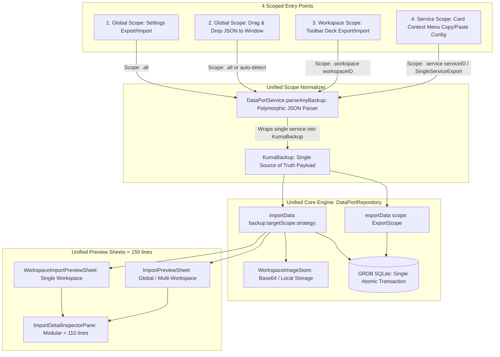

# Feature Spec 05: DataPort (Unified Backup, Scoped Export, Import & Reset)

> **Status:** Spec Refined (Unified Scoped Architecture)  
> **Target Version:** macOS 14+ (SwiftUI, Swift 6 Concurrency)  
> **Source Files:**  
> - `Kuma/Core/DataPort/DataPortService.swift` (MOD: Unified Payload Schema, Polymorphic JSON Parsing, Factory Reset)  
> - `Kuma/Core/Database/Repositories/DataPortRepository.swift` (MOD: Unified Scoped Export/Import Engine & Co-located Protocol)  
> - `Kuma/Presentation/Features/DataPort/Models/ImportPreviewModels.swift` (MOD: Presentation Table & Row Models)  
> - `Kuma/Presentation/Features/DataPort/Views/ImportPreviewSheet.swift` (MOD: Modular Unified Preview Sheet < 140 lines)  
> - `Kuma/Presentation/Features/DataPort/Views/WorkspaceImportPreviewSheet.swift` (MOD: Scoped Workspace Preview Sheet < 135 lines)  
> - `Kuma/Presentation/Features/DataPort/Views/Components/ImportDetailInspectorPane.swift` (MOD: Modularized Inspector < 110 lines)  
> - `Kuma/Presentation/Features/DataPort/Views/Components/ImportPreviewHeaderView.swift` (NEW: Extracted modular header)  
> - `Kuma/Presentation/Features/DataPort/Views/Components/ImportPreviewFooterView.swift` (NEW: Extracted modular footer)  
> - `Kuma/Presentation/Features/DataPort/Views/Components/ImportConfigurationSectionView.swift` (NEW: Extracted config rows)  
> - `Kuma/Presentation/Features/DataPort/Views/Components/ImportPortMappingsSectionView.swift` (NEW: Extracted port mappings list)  
> - `Kuma/Presentation/Features/Services/Views/Deck/ServicesDeckView+DataPort.swift` (MOD: Atomic file operations)  
> - `Kuma/ContentView.swift` (MOD: Unified DnD decoding supporting both full backup & single service)  
> - `KumaTests/Harness/DataPortTestHarness.swift` (NEW: Isolated SQLite In-Memory Database & Temp File Test Harness)  
> **Target Test Suites (`KumaTests/Features/DataPort/`):**  
> - `DataPortInitialStateTests.swift` (Kategori A: Baseline Structure, Polymorphic Parsing, Single-Service Wrap)  
> - `DataPortValidationAndSecurityTests.swift` (Kategori B: Scope Validation, Conflict Detection, Future Version Guard)  
> - `DataPortPersistenceAndSyncTests.swift` (Kategori C: Unified Scoped Export/Import, Re-ID Mapping, Memberships, Atomicity)  
> - `DataPortRuntimeAndResetTests.swift` (Kategori D: Storage Reset, ProcessRegistry Subprocess Termination, Workspace Isolation)  
> - `DataPortEdgeCasesAndErrorTests.swift` (Kategori E: Single-Service to Full Backup Conversion, Orphan Mappings, Missing Files)  
> - `DataPortVisualAndAccessibilityTests.swift` (Kategori F: Headless SwiftUI Master-Detail Sheets, Strict <150 Line Limits, HIG Accessibility)  

---

## 1. Unified Architecture & Scoping Hierarchy

Seluruh entry point DataPort menggunakan **1 schema baku tunggal (`KumaBackup`)** dan **1 pipeline engine tunggal (`DataPortRepository`)** dengan scope filter bertingkat:



---

## 2. Definisi Scoping Baku (`DataPortScope`)

```swift
public enum DataPortScope: Sendable, Equatable {
    case all
    case workspace(UUID)
    case service(UUID)
}

public enum DataPortImportStrategy: Sendable {
    /// Menjaga UUID asli jika tidak ada konflik, cocok untuk Full Backup Restore (Settings / DnD)
    case preserveOrMerge
    /// Selalu re-generate UUID baru (service, provider, port mapping) untuk mencegah konflik saat copy/import ke target workspace
    case reassignIDs(targetWorkspaceID: UUID)
}
```

### Pemetaan 4 Entry Point ke Pipeline Baku:

| Entry Point | Scope Export | Scope Import | Strategi ID | Penanganan JSON Format |
| :--- | :--- | :--- | :--- | :--- |
| **1. Settings (Data Section)** | `.all` | `.all` (atau selective via sheet) | `.preserveOrMerge` | `KumaBackup` (full) |
| **2. Drag & Drop (Window)** | N/A (Hanya Import) | `.all` (atau target active workspace) | `.preserveOrMerge` (jika multi-ws) atau `.reassignIDs` | Auto-detect: `KumaBackup` atau `SingleServiceExport` (di-wrap otomatis ke `KumaBackup`) |
| **3. Services Deck Toolbar** | `.workspace(workspaceID)` | `.workspace(workspaceID)` | `.reassignIDs(targetWorkspaceID:)` | `KumaBackup` berisikan 1 workspace saja |
| **4. Service Card Context Menu** | `.service(serviceID)` | Clipboard paste ke workspace aktif | `.reassignIDs(targetWorkspaceID:)` | `SingleServiceExport` atau `KumaBackup` (1 service) |

---

## 3. Invariant Rules (Kontrak Baku / Non-Negotiables)

1. **`[INV-DP-01]` Single Unified Schema Representation**:
   - Seluruh mutasi import/export pada level repository dan database HARUS menggunakan representasi `KumaBackup`.
   - `SingleServiceExport` adalah convenience format untuk clipboard yang secara deterministik dapat di-wrap menjadi `KumaBackup` via `DataPortService.wrapSingleService(_:)`.
2. **`[INV-DP-02]` Polymorphic JSON Ingestion (Zero Rejection on Drop)**:
   - Drag & Drop pada window dan import dialog HARUS mendeteksi secara otomatis apakah file yang di-drop adalah `KumaBackup` (full/workspace) atau `SingleServiceExport` (single service). Tidak boleh melempar error "Invalid Backup File" hanya karena formatnya single-service.
3. **`[INV-DP-03]` Atomic File Operations**:
   - Semua operasi write file ke disk (`NSSavePanel`, workspace export, backup export) WAJIB menggunakan opsi `.atomic`.
4. **`[INV-DP-04]` Relational Integrity & Single Atomic DB Transaction**:
   - Relasi Many-to-Many `service_group_membership`, `service`, `provider`, dan `portMapping` WAJIB disimpan dalam satu closure `dbWriter.write` atomic. Jika satu entitas gagal, seluruh transaksi rollback.
5. **`[INV-DP-05]` ID Collision Protection pada Scoped Import**:
   - Saat mengimpor dengan strategi `.reassignIDs(targetWorkspaceID:)`, seluruh UUID service, provider, dan port mapping HARUS dibuat baru dan foreign keys dipetakan ulang tanpa merusak relasi internal.
6. **`[INV-DP-06]` Conflict Detection & Deterministic Auto-Rename**:
   - Jika service yang diimpor memiliki nama yang sudah ada di target workspace, nama otomatis diubah menjadi `"\(name) (Imported)"`.
7. **`[INV-DP-07]` Clean Storage Reset**:
   - Factory reset WAJIB mematikan seluruh proses via `ProcessRegistry` sebelum menghapus records database, cache gambar, dan UserDefaults.
8. **`[INV-DP-08]` View Modularity & Strict Line Count Limit (< 150 Lines)**:
   - Seluruh file SwiftUI View DataPort HARUS didekomposisi ke `Views/Components/` dan berukuran `< 150 baris`.
9. **`[INV-DP-09]` Modern Path Handling**:
   - Dilarang keras menggunakan `.path` deprecated. Selalu gunakan `path(percentEncoded: false)`.
10. **`[INV-DP-10]` Swift 6 Strict Concurrency**:
    - Seluruh DTOs, Enums, Repositories, dan ViewModels DataPort WAJIB mematuhi `@Sendable` dan actor isolation (`@MainActor` vs `nonisolated`).
