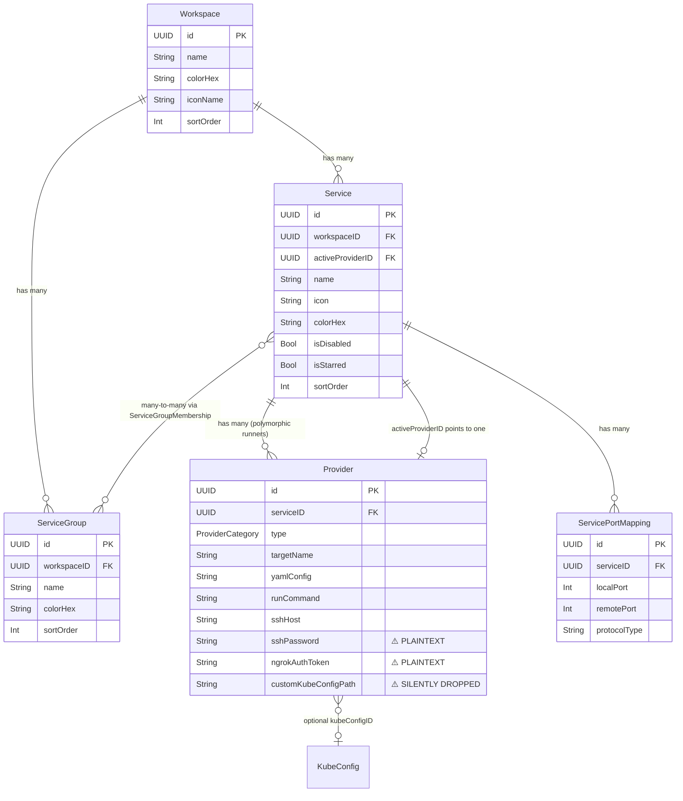
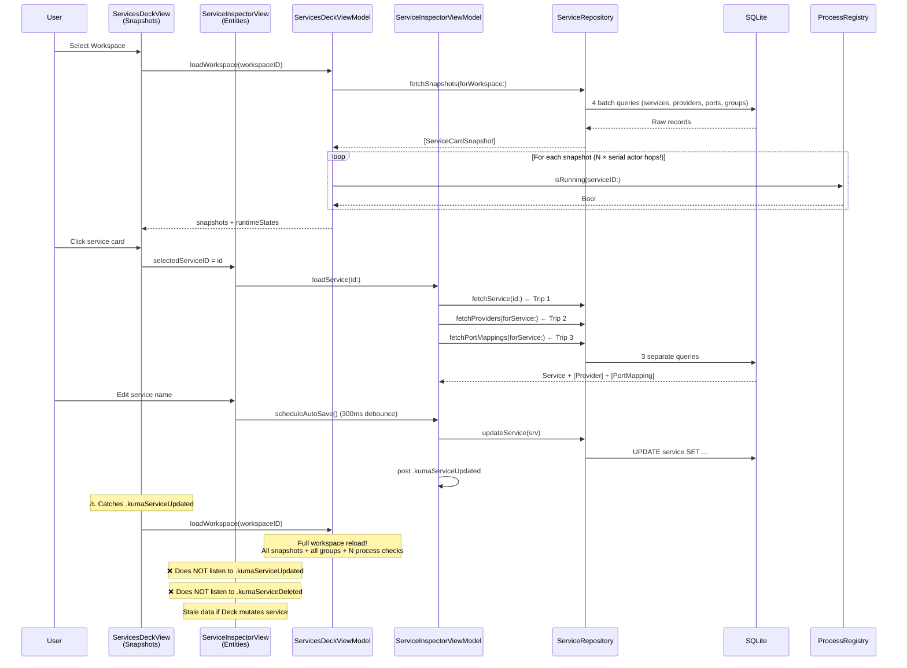

# Feature 06: Services — Deep Architectural Audit & Feature Spec

> **Scope**: Full audit of Services Deck, Inspector, CreateService, Forms, ViewModels, Domain models, DB Records/Repositories, Execution Engine, ProcessRegistry, LogAggregator, and LiveLogs.  
> **Files Audited**: 72+ files across Domain, Core, Stores, and Presentation layers.  
> **Verdict**: Structurally functional but architecturally **severely degraded** — critical security holes, broken state sync, layer violations, process lifecycle bugs, and 15 files over the 150-line limit.

---

## Table of Contents

1. [Severity Classification](#1-severity-classification)
2. [CRITICAL: Security Violations](#2-critical-security-violations)
3. [CRITICAL: Data Loss & Schema Desync](#3-critical-data-loss--schema-desync)
4. [CRITICAL: Process Lifecycle Race Conditions](#4-critical-process-lifecycle-race-conditions)
5. [CRITICAL: Deck ↔ Inspector State Desynchronization](#5-critical-deck--inspector-state-desynchronization)
6. [HIGH: Layer Boundary Violations](#6-high-layer-boundary-violations)
7. [HIGH: Performance & Idle Efficiency](#7-high-performance--idle-efficiency)
8. [HIGH: Broken / Incomplete Runner Features](#8-high-broken--incomplete-runner-features)
9. [MEDIUM: View Architecture & Line Count Violations](#9-medium-view-architecture--line-count-violations)
10. [MEDIUM: Accessibility & HIG Violations](#10-medium-accessibility--hig-violations)
11. [LOW: Dead Code & Cosmetic Issues](#11-low-dead-code--cosmetic-issues)
12. [Entity Relationship Architecture](#12-entity-relationship-architecture)
13. [Data Flow Analysis: Deck vs Inspector](#13-data-flow-analysis-deck-vs-inspector)
14. [Invariant Rules & Non-Negotiables](#14-invariant-rules--non-negotiables)

---

## 1. Severity Classification

| Severity | Count | Summary |
|:---------|:------|:--------|
| 🔴 **CRITICAL** | 9 | Security holes, data loss, process race conditions, broken state sync |
| 🟠 **HIGH** | 11 | Layer violations, performance anti-patterns, broken runners |
| 🟡 **MEDIUM** | 17 | 150-line violations, missing previews, accessibility gaps |
| 🟢 **LOW** | 6 | Dead code, cosmetic issues, naming inconsistencies |

---

## 2. CRITICAL: Security Violations

### SEC-01: Plaintext Passwords & Tokens in SQLite
- **Rule Violated**: AGENTS.md §4 — *"Plaintext passwords, tokens, and private SSH keys must be encrypted using `CryptoVault.shared.encrypt(plainText:)` before persisting to SQLite."*
- **Location**: [`Provider+Record.swift`](file:///Users/putra/Development/Personal/Projects/Kuma/Repositories/Kuma/Kuma/Core/Database/Records/Provider+Record.swift) lines 36, 42, 101, 106
- **Detail**: `sshPassword` and `ngrokAuthToken` are read from and written to SQLite in **unencrypted plaintext**. Neither `Provider+Record`, `ServiceRepository`, nor `CreateServiceSheet` passes credentials through `CryptoVault.shared.encrypt(plainText:)`.
- **Impact**: Any SQLite browser or backup export leaks user credentials in cleartext.

### SEC-02: Plaintext Credentials in JSON Backups
- **Location**: [`DataPortRepository.swift`](file:///Users/putra/Development/Personal/Projects/Kuma/Repositories/Kuma/Kuma/Core/Database/Repositories/DataPortRepository.swift) — `exportProviders` function
- **Detail**: Export engine serializes `sshPassword` and `ngrokAuthToken` directly into JSON backup files without encryption.

---

## 3. CRITICAL: Data Loss & Schema Desync

### DATA-01: `customKubeConfigPath` Silently Dropped
- **Location**: [`Provider.swift`](file:///Users/putra/Development/Personal/Projects/Kuma/Repositories/Kuma/Kuma/Domain/Models/Provider.swift) declares `public var customKubeConfigPath: String?`
- **Detail**: 
  1. `AppDatabase.swift` migration `v1_production_schema` **never created** a `customKubeConfigPath` column in the `provider` table.
  2. `Provider+Record.swift` silently omits `customKubeConfigPath` in both `init(row:)` and `encode(to:)`.
- **Impact**: Any user setting a custom kubeconfig path has their path **permanently lost** on persist/reload.

### DATA-02: Uncommitted Text Discarded on Inspector Dismiss
- **Location**: [`ServiceInspectorView.swift`](file:///Users/putra/Development/Personal/Projects/Kuma/Repositories/Kuma/Kuma/Presentation/Features/Services/Views/Inspector/ServiceInspectorView.swift) — `onDisappear`
- **Detail**: `onDisappear` calls `inspectorVM.cancelAutoSave()` **without committing**. If a user edits a field and closes the inspector within the 300ms debounce window, changes are permanently dropped.

### DATA-03: Global Log Wipe Instead of Per-Service Clear
- **Location**: [`InspectorStatusHeader.swift`](file:///Users/putra/Development/Personal/Projects/Kuma/Repositories/Kuma/Kuma/Presentation/Features/Services/Views/Inspector/InspectorStatusHeader.swift) line 134
- **Detail**: Trash button calls `LogAggregator.shared.clear()` without passing `serviceID`, **wiping ALL logs across ALL services** instead of clearing only the current service's logs.

---

## 4. CRITICAL: Process Lifecycle Race Conditions

### PROC-01: POSIX Process Group Race (`setpgid` After `run()`)
- **Location**: [`ProcessRegistry.swift`](file:///Users/putra/Development/Personal/Projects/Kuma/Repositories/Kuma/Kuma/Core/Execution/ProcessRegistry.swift) line 90
- **Detail**: `setpgid(pid, pid)` is invoked **after** `try process.run()`. If the child binary has already exec'd, `setpgid` fails with `EACCES`/`EPERM`. Return value is unhandled.
- **Impact**: Child processes may not be placed in isolated process groups, breaking orphan killing.

### PROC-02: Premature Pipe Teardown on Stop → SIGPIPE
- **Location**: [`ProcessRegistry.swift`](file:///Users/putra/Development/Personal/Projects/Kuma/Repositories/Kuma/Kuma/Core/Execution/ProcessRegistry.swift) `stop(serviceID:)` line 136
- **Detail**: `activeProcesses.removeValue(forKey:)` and `cleanupPipes()` execute **immediately before** sending `SIGINT`. If the child writes shutdown logs during the 1.5s grace window, it receives `SIGPIPE` and crashes.

### PROC-03: Missing Exit State Notification on Graceful Stop
- **Location**: [`ProcessRegistry.swift`](file:///Users/putra/Development/Personal/Projects/Kuma/Repositories/Kuma/Kuma/Core/Execution/ProcessRegistry.swift) — `stop()` + `handleProcessTerminated()`
- **Detail**: `stop()` removes the process from `activeProcesses`. When `terminationHandler` fires, `handleProcessTerminated` finds nothing and exits early **without posting `.kumaServiceStateChanged`**. The UI never learns a deliberate stop completed.

### PROC-04: Cooperative Thread Blocking in Async Engine
- **Location**: [`ServiceExecutionEngine.swift`](file:///Users/putra/Development/Personal/Projects/Kuma/Repositories/Kuma/Kuma/Core/Execution/ServiceExecutionEngine.swift) — `resolveDynamicPod()`, `killProcessOccupying()`
- **Detail**: Calls synchronous `process.waitUntilExit()` on the cooperative thread pool. Under load (many services starting simultaneously), this causes thread pool starvation.

---

## 5. CRITICAL: Deck ↔ Inspector State Desynchronization

### SYNC-01: Inspector Flattens Runtime State to Boolean
- **Location**: [`ServiceInspectorViewModel.swift`](file:///Users/putra/Development/Personal/Projects/Kuma/Repositories/Kuma/Kuma/Presentation/Features/Services/ViewModels/ServiceInspectorViewModel.swift) — `public var isRunning: Bool`
- **Rule Violated**: AGENTS.md §2 — *"Enums Over Multi-Booleans"*
- **Detail**: Inspector tracks runtime state via `isRunning: Bool`. States `.starting`, `.stopping`, and `.crashed` are **flattened to `false`**. `InspectorRunningBanner` branches for these states are dead code.
- **Chain**:
  ```
  ProcessRegistry → .kumaServiceStateChanged(ServiceState) 
  → ServiceInspectorView: inspectorVM.isRunning = state.isOperational  // .starting/.crashed → false
  → InspectorStatusHeader receives ServiceRuntimeState(status: isRunning ? .running : .stopped)
  → .starting / .stopping / .crashed states NEVER reach UI
  ```

### SYNC-02: Inspector Ignores Deck Mutations
- **Location**: [`ServiceInspectorView.swift`](file:///Users/putra/Development/Personal/Projects/Kuma/Repositories/Kuma/Kuma/Presentation/Features/Services/Views/Inspector/ServiceInspectorView.swift)
- **Detail**: Inspector listens **only** to `.kumaServiceStateChanged`. It does **NOT** observe:
  - `.kumaServiceUpdated` — provider switch, rename, star, disable from Deck
  - `.kumaServiceDeleted` — service deleted from context menu while Inspector is open
  - `.kumaGroupsUpdated` — group membership changes
- **Impact**: Inspector displays stale data after any Deck-initiated mutation until manually reopened.

### SYNC-03: Full Workspace Reload on Every Single Keystroke
- **Detail**: Every debounced auto-save from Inspector writes to SQLite → posts `.kumaServiceUpdated` → Deck responds by reloading **ALL** snapshots, groups, and process states for the **entire workspace**.
- **Impact**: Typing in a text field triggers a full O(N) workspace reload every 300ms.

### SYNC-04: Optimistic Update Overwrite Race
- **Location**: [`ServicesDeckViewModel.swift`](file:///Users/putra/Development/Personal/Projects/Kuma/Repositories/Kuma/Kuma/Presentation/Features/Services/ViewModels/ServicesDeckViewModel.swift) — `toggleStarred()`
- **Detail**: Mutates local state optimistically → posts `.kumaServiceUpdated` → Deck catches notification and triggers `loadWorkspaceAsync`. If SQLite write latency exceeds notification delivery, the reload reads pre-update data, overwriting the optimistic state → UI flicker.

---

## 6. HIGH: Layer Boundary Violations

### LAYER-01: Core → Presentation Import
- **Location**: [`ServiceRepository.swift`](file:///Users/putra/Development/Personal/Projects/Kuma/Repositories/Kuma/Kuma/Core/Database/Repositories/ServiceRepository.swift) — `fetchSnapshots()`
- **Rule Violated**: AGENTS.md §1 — *"Lower layers NEVER import higher layers."*
- **Detail**: `ServiceRepository` (Core layer) directly imports and returns `ServiceCardSnapshot` from `Presentation/Features/Services/Models/`.

### LAYER-02: Domain Imports SwiftUI
- **Locations**: 
  - [`ProviderCategory.swift`](file:///Users/putra/Development/Personal/Projects/Kuma/Repositories/Kuma/Kuma/Domain/Enums/ProviderCategory.swift) — `import SwiftUI`, declares `Color`, `LinearGradient`
  - [`ServiceEnums.swift`](file:///Users/putra/Development/Personal/Projects/Kuma/Repositories/Kuma/Kuma/Domain/Enums/ServiceEnums.swift) — `import SwiftUI`, declares `Color`
- **Rule Violated**: AGENTS.md §1 — *"Domain/ → Pure Swift models, enums (ZERO UI / DB dependencies)"*
- **Detail**: Presentation tokens (`Color`, `LinearGradient`, SF Symbol mappings) are defined inside Domain enums.

### LAYER-03: UI Enums in Domain Layer
- **Location**: [`ServiceEnums.swift`](file:///Users/putra/Development/Personal/Projects/Kuma/Repositories/Kuma/Kuma/Domain/Enums/ServiceEnums.swift)
- **Detail**: `DeckViewMode` (`.card` / `.table`) and `ServiceStatusFilterOption` are purely presentation-layer view configs dumped into Domain.

### LAYER-04: Struct in Enums Folder
- **Location**: [`ServiceRuntimeState.swift`](file:///Users/putra/Development/Personal/Projects/Kuma/Repositories/Kuma/Kuma/Domain/Enums/ServiceRuntimeState.swift)
- **Detail**: `ServiceRuntimeState` is a `struct`, not an `enum`, but placed in `Domain/Enums/`.

---

## 7. HIGH: Performance & Idle Efficiency

### PERF-01: Sequential Actor Crossing Loop (N×Actor Hops)
- **Location**: [`ServicesDeckViewModel.swift`](file:///Users/putra/Development/Personal/Projects/Kuma/Repositories/Kuma/Kuma/Presentation/Features/Services/ViewModels/ServicesDeckViewModel.swift) — `loadWorkspaceAsync()`
- **Detail**: 
  ```swift
  for snapshot in loaded {
      let isProcessActive = await ProcessRegistry.shared.isRunning(serviceID: snapshot.id)
  }
  ```
  For 50 services → 50 serial actor crossings to `ProcessRegistry`. Should be a single batch lookup.

### PERF-02: O(n) Array Truncation in LogAggregator
- **Location**: [`LogAggregator.swift`](file:///Users/putra/Development/Personal/Projects/Kuma/Repositories/Kuma/Kuma/Core/Execution/LogAggregator.swift) line 51
- **Detail**: `entries.removeFirst(entries.count - maxEntries)` shifts all remaining elements. Under rapid streaming with 2000-element buffer, this repeatedly shifts thousands of elements. Needs circular ring buffer.

### PERF-03: MainActor Task Flooding from Log Pipeline
- **Location**: [`ServiceExecutionEngine.swift`](file:///Users/putra/Development/Personal/Projects/Kuma/Repositories/Kuma/Kuma/Core/Execution/ServiceExecutionEngine.swift) — `makeLogPipeline()`
- **Detail**: Every stdout line creates **two** unthrottled tasks (`Task { @MainActor in LogAggregator... }` + `Task { await LogFileWriter... }`). At 500 lines/sec → 1,000 tasks/sec flooding the MainActor runloop.

### PERF-04: LiveLogsView Body Computation
- **Location**: [`LiveLogsView.swift`](file:///Users/putra/Development/Personal/Projects/Kuma/Repositories/Kuma/Kuma/Presentation/Features/LiveLogs/Views/LiveLogsView.swift) line 36
- **Detail**: `Array(Set(logAggregator.entries.map(\.serviceName))).sorted()` runs inside the view body. Every appended log re-maps, deduplicates, and sorts on the MainActor.

### PERF-05: 10 Concurrent Notification Loops
- **Location**: [`ServicesDeckView.swift`](file:///Users/putra/Development/Personal/Projects/Kuma/Repositories/Kuma/Kuma/Presentation/Features/Services/Views/Deck/ServicesDeckView.swift)
- **Detail**: 10 separate `.task` modifiers each run an infinite `for await` stream on `NotificationCenter`. When views rebuild, all 10 are torn down and recreated.

### PERF-06: ISO8601DateFormatter Created on Every Flush
- **Location**: [`LogFileWriter.swift`](file:///Users/putra/Development/Personal/Projects/Kuma/Repositories/Kuma/Kuma/Core/Execution/LogFileWriter.swift) line 67
- **Detail**: `let dateFormatter = ISO8601DateFormatter()` instantiated inside `flushBuffer()` on every flush cycle instead of being cached.

### PERF-07: Unbounded Disk Log Growth
- **Location**: [`LogFileWriter.swift`](file:///Users/putra/Development/Personal/Projects/Kuma/Repositories/Kuma/Kuma/Core/Execution/LogFileWriter.swift)
- **Detail**: No log retention enforcement despite `KumaSettingsKey.logRetentionLimit` existing. Log files accumulate indefinitely.

### PERF-08: Triple Database Trip on Inspector Open
- **Location**: [`ServiceInspectorViewModel.swift`](file:///Users/putra/Development/Personal/Projects/Kuma/Repositories/Kuma/Kuma/Presentation/Features/Services/ViewModels/ServiceInspectorViewModel.swift) — `loadService()`
- **Detail**: Makes 3 distinct DB roundtrips (`fetchService`, `fetchProviders`, `fetchPortMappings`) instead of a single unified query.

### PERF-09: Idle State Not Zero-Effort
- **Summary**: When NO services are running:
  - 10 notification listener tasks still active on Deck
  - `LogAggregator` still observable (triggers body recompute on any property access)
  - No throttling/gating on notification observers
  - **Should be**: Zero active polling, zero timers, zero background work when idle.

---

## 8. HIGH: Broken / Incomplete Runner Features

### RUN-01: Docker/Podman YAML Config Ignored
- **Location**: [`ServiceExecutionEngine.swift`](file:///Users/putra/Development/Personal/Projects/Kuma/Repositories/Kuma/Kuma/Core/Execution/ServiceExecutionEngine.swift) — `startContainer()`
- **Detail**: `provider.yamlConfig` is never written to disk or passed via `-f` to `docker compose`. Assumes compose file already exists in `workingDirectory`.

### RUN-02: SSH Runner Ignores Key Path
- **Location**: [`ServiceExecutionEngine.swift`](file:///Users/putra/Development/Personal/Projects/Kuma/Repositories/Kuma/Kuma/Core/Execution/ServiceExecutionEngine.swift) — `startSSH()`
- **Detail**: `provider.sshKeyPath` is never passed with `-i` flag.

### RUN-03: Shell Runner Hardcodes `/bin/zsh`
- **Location**: [`ServiceExecutionEngine.swift`](file:///Users/putra/Development/Personal/Projects/Kuma/Repositories/Kuma/Kuma/Core/Execution/ServiceExecutionEngine.swift) — `startShell()`
- **Detail**: Ignores `KumaSettingsKey.defaultShell` and user path overrides.

### RUN-04: SSH Auth Type Binding Broken
- **Location**: [`InspectorFormSections.swift`](file:///Users/putra/Development/Personal/Projects/Kuma/Repositories/Kuma/Kuma/Presentation/Features/Services/Views/Inspector/InspectorFormSections.swift) lines 155-157
- **Detail**: `authType` Binding `set` closure ignores the new value; selected auth type is never persisted to the Provider model.

---

## 9. MEDIUM: View Architecture & Line Count Violations

### 15 Files Exceed 150-Line Limit

| File | Lines | Excess |
|:-----|:------|:-------|
| `ServicesDeckViewModel.swift` | 528 | +378 |
| `ServiceInspectorViewModel.swift` | 353 | +203 |
| `KubeConfigViewModel.swift` | 271 | +121 |
| `ServicesDeckView.swift` | 254 | +104 |
| `ServiceTableView.swift` | 238 | +88 |
| `CreateServiceSheet.swift` | 237 | +87 |
| `InspectorStatusHeader.swift` | 207 | +57 |
| `ServiceInspectorView.swift` | 199 | +49 |
| `CreateServiceFillDetailsStepView.swift` | 190 | +40 |
| `ServicesToolbar.swift` | 189 | +39 |
| `ServiceProvidersSectionView.swift` | 183 | +33 |
| `ServiceActionContextMenu.swift` | 179 | +29 |
| `InspectorOptionsSection.swift` | 178 | +28 |
| `ServiceCardView.swift` | 176 | +26 |
| `KubeConfigConnectionView.swift` | 153 | +3 |
| `ContentView.swift` | 152 | +2 |

### 21 Views Missing `#Preview` Blocks (See Full List in Audit)

---

## 10. MEDIUM: Accessibility & HIG Violations

### 10 Icon-Only Buttons Missing `.accessibilityLabel(...)`

1. `ServicesToolbar.swift:163` — Sidebar toggle
2. `ServiceTableView.swift:177` — Row actions ellipsis
3. `ServiceCardView.swift:165` — Card toggle switch
4. `ServiceCardView.swift:160` — Lock badge
5. `InspectorStatusHeader.swift:42` — Back chevron
6. `InspectorStatusHeader.swift:133` — Clear logs (trash)
7. `InspectorOptionsSection.swift:39` — Disable switch
8. `ServiceProvidersInlineFormView.swift:22` — Cancel xmark
9. `DockerComposeSettingsView.swift:56` — Close button
10. `InitialScriptSettingsView.swift:56` — Close button

---

## 11. LOW: Dead Code & Cosmetic Issues

| Issue | Location |
|:------|:---------|
| `ServiceNonPortBadge.metadata` — 20-line computed property never referenced | `ServiceNonPortBadge.swift` |
| `ServiceTableView.isMonospaced` — private helper never invoked | `ServiceTableView.swift` |
| `InspectorLiveConsoleView.copiedRecently` — unused `@State` | `InspectorLiveConsoleView.swift` |
| `InspectorStatusHeader.onToggleStar` — closure never bound to UI | `InspectorStatusHeader.swift` |
| `LiveLogsView.isAutoScroll` — toggle exists but no `ScrollViewReader` implemented | `LiveLogsView.swift` |
| `PodmanComposeSettingsView` — 100% duplicate of `DockerComposeSettingsView` | `PodmanComposeSettingsView.swift` |
| Table name inconsistency: `"portMapping"` (camelCase) vs all others (`snake_case`) | `ServicePortMapping+Record.swift` |
| `Provider.kubeTargetType: String?` raw String instead of typed `KubeTargetType?` | `Provider.swift` |
| `ServiceRuntimeState` uses multi-boolean (`status` + `isLoading`) instead of single enum | `ServiceRuntimeState.swift` |
| Legacy GCD timer `DispatchQueue.main.asyncAfter` instead of Swift Concurrency | `InspectorStatusHeader.swift` |

---

## 12. Entity Relationship Architecture



---

## 13. Data Flow Analysis: Deck vs Inspector



### The Core Problem

**Deck** uses lightweight `ServiceCardSnapshot` projections — good for 120fps rendering.  
**Inspector** uses full `Service` + `Provider` + `PortMapping` entities — good for editing.  
**But they share NO reactive state bridge.** They communicate only through fire-and-forget `NotificationCenter` posts, and the Inspector **doesn't even listen to most of them**.

When idle, the system should be **zero-effort** — no polling, no timers, no background work. Currently, 10 notification listener tasks run permanently on the Deck regardless of activity.

---

## 14. Invariant Rules & Non-Negotiables

1. **Single Source of Truth**: Both Deck and Inspector must derive state from the same reactive pipeline. No divergent data paths.
2. **Enum-Driven State**: `ServiceExecutionState` must be a discrete enum with associated values (`.idle`, `.starting(progress:)`, `.running(pid:)`, `.stopping`, `.crashed(exitCode:)`), never a bool.
3. **Zero-Effort Idle**: When no services are running and no user interaction is happening, CPU usage must be effectively 0%. No polling, no timers, no active notification streams.
4. **Background-Only Processing**: All process lifecycle checks, port scanning, and status polling must run off the MainActor. UI receives state changes via `@Observable` diffing only.
5. **Batch Operations**: Process status lookups must be batch (single actor crossing), not N×serial.
6. **Credentials Always Encrypted**: `CryptoVault.shared.encrypt` / `decrypt` for all passwords, tokens, and private keys before SQLite persistence.
7. **Views < 150 Lines**: No exceptions.
8. **Pipe Lifecycle**: Pipes must remain open until child process exits. Cleanup after termination, not before.
