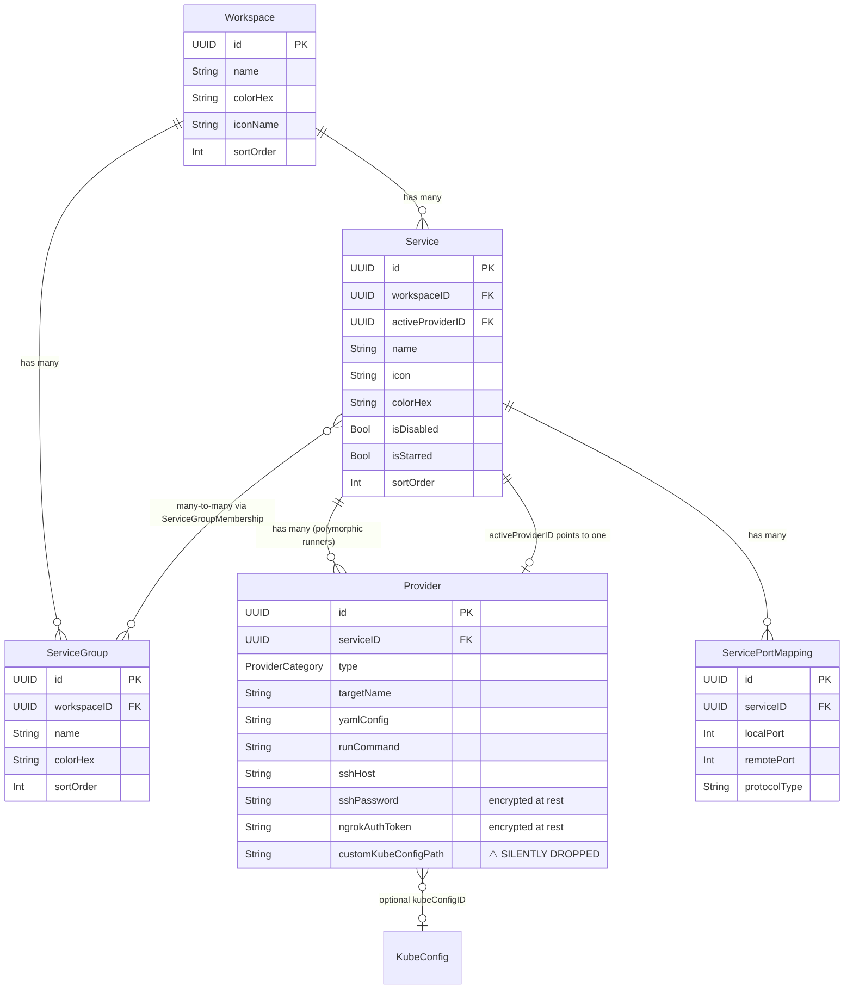
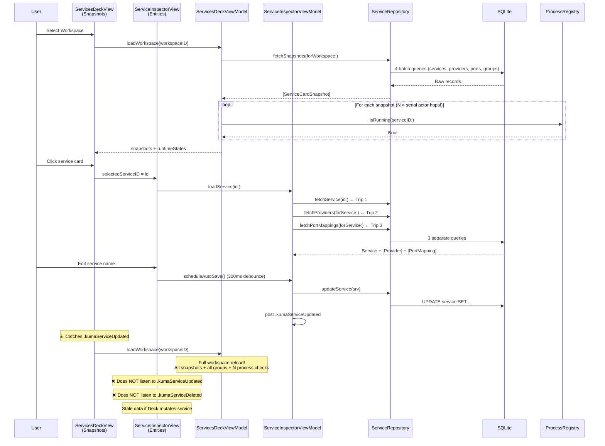

# Feature 06: Services — Deep Architectural Audit & Feature Spec

> **Scope**: Services Deck, Inspector, CreateService, Forms, ViewModels, Domain models, DB Records/Repositories, **ExecutionSupervisor** (managed process / compose / poller modes), ProcessRegistry, **LiveLogSession** (inspector-only).  
> **Files Audited**: 72+ files across Domain, Core, Stores, and Presentation layers.  
> **Verdict**: Structurally functional but architecturally **severely degraded** — critical security holes, broken state sync, layer violations, process lifecycle bugs, and 15 files over the 150-line limit.

---

## Table of Contents

1. [Severity Classification](#1-severity-classification)
2. [CRITICAL: Security Violations](#2-critical-security-violations)
3. [CRITICAL: Data Loss & Schema Desync](#3-critical-data-loss--schema-desync)
4. [CRITICAL: Process Lifecycle Race Conditions](#4-critical-process-lifecycle-race-conditions)
5. [CRITICAL: Deck ↔ Inspector State Desynchronization](#5-critical-deck--inspector-state-desynchronization)
6. [HIGH: Layer Boundary Violations](#6-high-layer-boundary-violations)
7. [HIGH: Performance & Idle Efficiency](#7-high-performance--idle-efficiency)
8. [HIGH: Broken / Incomplete Runner Features](#8-high-broken--incomplete-runner-features)
9. [MEDIUM: View Architecture & Line Count Violations](#9-medium-view-architecture--line-count-violations)
10. [MEDIUM: Accessibility & HIG Violations](#10-medium-accessibility--hig-violations)
11. [LOW: Dead Code & Cosmetic Issues](#11-low-dead-code--cosmetic-issues)
12. [Entity Relationship Architecture](#12-entity-relationship-architecture)
13. [Data Flow Analysis: Deck vs Inspector](#13-data-flow-analysis-deck-vs-inspector)
14. [Invariant Rules & Non-Negotiables](#14-invariant-rules--non-negotiables)

---

## Kubernetes target type × pattern (runtime contract)

[`KubeTargetResolver`](Kuma/Core/Kubernetes/KubeTargetResolver.swift) resolves `kind/name` for **port-forward** ([`KubernetesRunner`](Kuma/Core/Execution/Runners/KubernetesRunner.swift)) and **live logs** ([`LiveLogSourceRunner`](Kuma/Presentation/Features/LiveLogs/LiveLogSourceRunner.swift)). Legacy providers with nil `kubeTargetType` default to **Pod**; nil `usePattern` defaults to **true**.

| Target type | Pattern ON | Pattern OFF |
|-------------|------------|-------------|
| Pod | `kubectl get pods` (Running) → match | `pod/<name>` verbatim |
| Service | `kubectl get services` → match | `service/<name>` verbatim |
| Deployment | `kubectl get deployments` → match | `deployment/<name>` verbatim |

Pattern rules ([`KubeTargetNameMatcher`](Kuma/Core/Kubernetes/KubeTargetNameMatcher.swift)): with pattern matching **off**, the target name is verbatim. With pattern **on**, `kubectl get` lists resources of the selected type; `*` → substring match; otherwise exact name, or for **Pod** only also `<name>-<replica-suffix>`. Tie-break = lexicographic first among sorted names.

Example: `forwarder-elasticsearch-stage` is usually a **Deployment** (or Service), not a Pod — set Target Type accordingly or port-forward fails with `pods "…" not found`.

---

## 1. Severity Classification

| Severity | Count | Summary |
|:---------|:------|:--------|
| 🔴 **CRITICAL** | 9 | Security holes, data loss, process race conditions, broken state sync |
| 🟠 **HIGH** | 11 | Layer violations, performance anti-patterns, broken runners |
| 🟡 **MEDIUM** | 17 | 150-line violations, missing previews, accessibility gaps |
| 🟢 **LOW** | 6 | Dead code, cosmetic issues, naming inconsistencies |

---

## 2. CRITICAL: Security Violations

### SEC-01: Plaintext Passwords & Tokens in SQLite — **Fixed**
- **Rule Violated**: AGENTS.md §4 — *"Plaintext passwords, tokens, and private SSH keys must be encrypted using `CryptoVault.shared.encrypt(plainText:)` before persisting to SQLite."*
- **Location**: [`Provider+Record.swift`](Kuma/Core/Database/Records/Provider+Record.swift), [`CredentialProtector.swift`](Kuma/Core/Security/CredentialProtector.swift), [`CreateServicePayloadBuilder.swift`](Kuma/Presentation/Features/Services/Views/CreateService/Components/CreateServicePayloadBuilder.swift)
- **Resolution**: Create path keeps **plaintext** on domain `Provider`; **only** `Provider+Record.encode` encrypts via `CredentialProtector` (throws on failure — no `?? plaintext` fallback). `sshKeyPath` remains a filesystem path, not encrypted.
- **Note**: Rows double-encrypted before this fix may need re-save from Inspector if decrypt fails.

### SEC-02: Plaintext Credentials in JSON Backups — **Fixed**
- **Location**: [`DataPortRepository+Mapping.swift`](Kuma/Core/Database/Repositories/DataPortRepository+Mapping.swift) — `toExportProvider`
- **Resolution**: Export encrypts credentials for JSON backup; encrypt failure **fails the export** (fail-closed). Covered by **TC-B02b** (no plaintext password substring in export JSON).

---

## 3. CRITICAL: Data Loss & Schema Desync

### DATA-01: `customKubeConfigPath` (legacy)
- **Status**: Column exists via migration `v4_provider_custom_kubeconfig`; `Provider+Record` persists the field. **No UI** writes this value — prefer `kubeConfigID` + Settings default kube path. `KubeConfigMaterializer` still honors legacy path on import/migration for backward compatibility.

### Kubeconfig registry (custom `kube_config` rows)
- **UI**: Add/edit uses one registry inline panel: Config Name, **Config** section (segment Choose file / Paste Config + picker or editor), divider between Name and Config, single Cancel/Save footer — no nested source panel or Import File action.
- **Storage**: Migration `v7_kube_config_source_path` adds `sourceFilePath`. File-backed rows store path on disk and empty encrypted payload; paste-backed rows store vault ciphertext only. `KubeConfigMaterializer` prefers `sourceFilePath` when present. DataPort `ExportKubeConfig.path` round-trips on import/export.

### DATA-02: Uncommitted Text Discarded on Inspector Dismiss — **Fixed**
- **Location**: [`ServiceInspectorView.swift`](Kuma/Presentation/Features/Services/Views/Inspector/ServiceInspectorView.swift), [`ServiceInspectorViewModel+AutoSave.swift`](Kuma/Presentation/Features/Services/ViewModels/ServiceInspectorViewModel+AutoSave.swift)
- **Resolution**: `onDisappear` flushes pending auto-save; revision counter commits any dirty state even when the debounce task already completed. **TC-E01** / **TC-E01b**.

### Live logs (Inspector)
- **Stream**: [`LiveLogSession`](Kuma/Presentation/Features/LiveLogs/LiveLogSession.swift) — `LiveLogSourceRunner` starts only when **log panel is open** and the service is **running**; stops when the service stops. **Closing the panel** stops the stream and **clears** the in-memory buffer (no hidden retention). Ring **1,000 lines**, ~30 Hz UI coalesce, no disk.
- **Display**: [`KumaLogConsoleView`](Kuma/Presentation/Components/KumaLogConsoleView.swift) — AppKit `NSTextView`, **raw** lines; stable line IDs; text selectable (⌘C). Copy-all button removed.
- **Header (logs mode)**: native SwiftUI icon controls — auto-scroll, wrap/no-wrap, clear display, download (`NSSavePanel` plain text). Start/Stop from deck/context menu only.
- **Trim notice**: one-shot “Showing last 1,000 lines” above the console when the ring buffer drops oldest lines.
- **Search**: not implemented; future options are in-buffer filter or native NSTextView find — no disk index.

### UX: Inspector header Start / Stop
- **Location**: [`InspectorHeaderActionButtons.swift`](Kuma/Presentation/Features/Services/Views/Inspector/Components/InspectorHeaderActionButtons.swift), [`KumaPrimaryButton.swift`](Kuma/Presentation/Components/KumaPrimaryButton.swift)
- **Behavior**: Compact header toggle uses `KumaPrimaryButtonStyle.inspectorToggle` — **Start** fill is `Color.accentColor` (same as onboarding primary); **Stop** fill is `KumaStatus.destructiveButtonFill` (saturated button red, not status-dot coral); white label, shared stroke/shadow/press treatment. Busy states block taps via `allowsHitTesting` so fill does not macOS-disable fade.

---

## 4. CRITICAL: Process Lifecycle Race Conditions

### PROC-01: POSIX Process Group Race (`setpgid` After `run()`) — **Fixed**
- **Location**: [`ProcessRegistry.swift`](Kuma/Core/Execution/ProcessRegistry.swift)
- **Resolution**: After `run()`, `setpgid` outcome selects `SignalTarget` (process group vs single PID); `kill()` uses `-pgid` or PID accordingly.

### PROC-02: Premature Pipe Teardown on Stop → SIGPIPE — **Fixed**
- **Location**: [`ProcessRegistry.swift`](Kuma/Core/Execution/ProcessRegistry.swift) `stop(serviceID:)`
- **Resolution**: Pipes stay open through signal escalation; `cleanupPipes(drainRemaining:)` runs only in `handleProcessTerminated`.

### PROC-03: Missing Exit State Notification on Graceful Stop — **Fixed**
- **Location**: [`ProcessRegistry.swift`](Kuma/Core/Execution/ProcessRegistry.swift) — `stop()` + `handleProcessTerminated()`
- **Resolution**: `stop()` no longer removes the managed process early; termination handler owns cleanup and posts `.kumaServiceStateChanged` (`.stopped`). SIGKILL timeout path calls `handleProcessTerminated` as fallback. **TC-D05** asserts stopped notification after graceful stop.

### PROC-04: Cooperative Thread Blocking in Async Engine
- **Location**: [`ServiceExecutionEngine.swift`](file:///Users/putra/Development/Personal/Projects/Kuma/Repositories/Kuma/Kuma/Core/Execution/ServiceExecutionEngine.swift) — `resolveDynamicPod()`, `killProcessOccupying()`
- **Detail**: Calls synchronous `process.waitUntilExit()` on the cooperative thread pool. Under load (many services starting simultaneously), this causes thread pool starvation.

---

## 5. CRITICAL: Deck ↔ Inspector State Desynchronization

### SYNC-01: Inspector Flattens Runtime State to Boolean — **Fixed**
- **Location**: [`ServiceInspectorView.swift`](Kuma/Presentation/Features/Services/Views/Inspector/ServiceInspectorView.swift), [`ServiceInspectorViewModel`](Kuma/Presentation/Features/Services/ViewModels/ServiceInspectorViewModel.swift)
- **Resolution**: Inspector reads `ServiceStateStore` via `executionState` / `ServiceRuntimeState(executionState:)` for header, lock, and banner; `.starting` / `.stopping` / `.crashed` are no longer flattened to a lone `isRunning` binding.

### SYNC-02: Inspector Ignores Deck Mutations — **Fixed (partial)**
- **SYNC-02b**: [`ServiceInspectorView`](Kuma/Presentation/Features/Services/Views/Inspector/ServiceInspectorView.swift) handles `.kumaServiceDeleted` via `clearAfterExternalDeletion()` (**TC-C12**).
- **Location**: [`ServiceInspectorView.swift`](Kuma/Presentation/Features/Services/Views/Inspector/ServiceInspectorView.swift)
- **Resolution**: Inspector reloads on `.kumaServiceUpdated` (skips `source == inspector`) and `.kumaGroupsUpdated`; service delete is handled by Deck (close inspector + clear selection). Previously missing observers:
  - `.kumaServiceUpdated` — provider switch, rename, star, disable from Deck
  - `.kumaServiceDeleted` — service deleted from context menu while Inspector is open
  - `.kumaGroupsUpdated` — group membership changes
- **Impact**: Inspector displays stale data after any Deck-initiated mutation until manually reopened.

### SYNC-03: Full Workspace Reload on Every Single Keystroke — **Fixed (partial)**
- **Detail**: Deck uses `refreshSingleServiceSnapshot` for single-service mutations; duplicate/delete/provider-switch error paths no longer call `loadWorkspaceAsync` (**TC-C11**).
- **Remaining**: Inspector auto-save may still post `.kumaServiceUpdated` frequently — deck skips deck-sourced events via `KumaServiceNotification.sourceDeck`.

### SYNC-04: Optimistic Update Overwrite Race — **Fixed (partial)**
- **Location**: [`ServicesDeckView+Notifications.swift`](Kuma/Presentation/Features/Services/Views/Deck/ServicesDeckView+Notifications.swift), [`ServicesDeckViewModel+ServiceActions.swift`](Kuma/Presentation/Features/Services/ViewModels/ServicesDeckViewModel+ServiceActions.swift)
- **Resolution**: Deck-initiated updates post `userInfo[source] = deck`; deck notification handler **skips** `refreshSingleServiceSnapshot` for those events so optimistic UI is not overwritten by a redundant reload.

---

## 6. HIGH: Layer Boundary Violations

### LAYER-01: Core → Presentation Import — **Fixed**
- **Location**: [`ServiceRepository+DeckItems.swift`](Kuma/Core/Database/Repositories/ServiceRepository+DeckItems.swift), [`ServiceDeckItem.swift`](Kuma/Domain/Models/ServiceDeckItem.swift), [`ServiceCardSnapshot.swift`](Kuma/Presentation/Features/Services/Models/ServiceCardSnapshot.swift)
- **Resolution**: Repository returns **Domain** `ServiceDeckItem` only (`fetchDeckItems` / `fetchDeckItem`). Presentation maps to `ServiceCardSnapshot`: card subtitle is **service description** when set, else **active provider `resolvedTarget`**, else empty (UI falls back to provider category label); **search key** indexes name, description, target, provider labels, and local ports for deck filter.

### LAYER-02: Domain Imports SwiftUI — **Fixed**
- **Resolution**: Provider chrome (`Color`, `LinearGradient`) moved to [`ProviderCategory+Theme.swift`](Kuma/Presentation/Theme/ProviderCategory+Theme.swift). Domain [`ProviderCategory.swift`](Kuma/Domain/Enums/ProviderCategory.swift) is Foundation-only.

### LAYER-03: UI Enums in Domain Layer — **Fixed**
- **Resolution**: `DeckViewMode`, `ServiceStatusFilterOption`, and `ServiceSortOption` live in [`ServicesDeckUIEnums.swift`](Kuma/Presentation/Features/Services/Models/ServicesDeckUIEnums.swift).

### LAYER-04: Struct in Enums Folder — **Fixed**
- **Location**: [`ServiceRuntimeState.swift`](Kuma/Domain/Models/ServiceRuntimeState.swift)
- **Resolution**: Moved from `Domain/Enums/` to `Domain/Models/`.

---

## 7. HIGH: Performance & Idle Efficiency

### PERF-01: Sequential Actor Crossing Loop (N×Actor Hops) — **Fixed**
- **Location**: [`ServicesDeckViewModel+WorkspaceLoad.swift`](Kuma/Presentation/Features/Services/ViewModels/ServicesDeckViewModel+WorkspaceLoad.swift)
- **Resolution**: `ServiceStateStore.refreshProcessStates(for: serviceIDs)` batch via `ProcessRegistry.runningStates`. **TC-D04**.

### PERF-02: Log buffer truncation — **Fixed** (legacy LogAggregator removed)
- **Location**: [`LiveLogSession.swift`](Kuma/Presentation/Features/LiveLogs/LiveLogSession.swift)
- **Resolution**: Cap 1,000 lines via `suffix`; trim notice in UI. **TC-L10**.

### PERF-03: MainActor Task Flooding from Log Pipeline — **Fixed**
- **Location**: [`LiveLogSession.swift`](Kuma/Presentation/Features/LiveLogs/LiveLogSession.swift)
- **Resolution**: ~30 Hz coalesced flush to `lines`; incremental NSTextView append when line IDs stable. **TC-L12**, **TC-L11**.

### PERF-05: 10 Concurrent Notification Loops — **Fixed**
- **Location**: [`ServicesDeckView+Notifications.swift`](Kuma/Presentation/Features/Services/Views/Deck/ServicesDeckView+Notifications.swift)
- **Resolution**: Single merged `AnyPublisher` + `switch` handler (no per-notification `.task` loops).

### PERF-06 / PERF-07: Legacy disk log pipeline — **Removed**
- **Location**: (removed) `LogFileWriter` / global log aggregation
- **Resolution**: Runner output spools via [`RunSpool`](Kuma/Core/Execution/Supervision/RunSpool.swift); live UI uses in-memory [`LiveLogSession`](Kuma/Presentation/Features/LiveLogs/LiveLogSession.swift) (1,000-line cap). Legacy `UserDefaults` log keys are cleared on factory reset only.

### PERF-10: Deck Card Observation Fan-Out — **Fixed**
- **Location**: [`ServiceCardRow.swift`](Kuma/Presentation/Features/Services/Views/Deck/Components/ServiceCardRow.swift), [`SyncedServiceRuntime.swift`](Kuma/Presentation/Features/Services/Views/Deck/Components/SyncedServiceRuntime.swift), [`ServiceTableColumns.swift`](Kuma/Presentation/Features/Services/Views/Deck/Components/ServiceTableColumns.swift)
- **Resolution**: Row runtime synced via `@State` + per-ID `.kumaServiceStateChanged` (store not read in `body`); `ServiceDeckActions` environment; **TC-G02** source + headless checks.

### PERF-08: Triple Database Trip on Inspector Open — **Fixed**
- **Location**: [`ServiceInspectorViewModel+Loading.swift`](Kuma/Presentation/Features/Services/ViewModels/ServiceInspectorViewModel+Loading.swift), [`ServiceRepository+CRUD.swift`](Kuma/Core/Database/Repositories/ServiceRepository+CRUD.swift)
- **Resolution**: `fetchServiceDetail` single read transaction. **TC-C01**.

### PERF-09: Idle State Not Zero-Effort — **Fixed**
- **Location**: [`ServicesDeckView+Notifications.swift`](Kuma/Presentation/Features/Services/Views/Deck/ServicesDeckView+Notifications.swift), [`ServicesDeckRuntimeObservation.swift`](Kuma/Presentation/Features/Services/Views/Deck/ServicesDeckRuntimeObservation.swift)
- **Resolution**: Idle gate on state-changed notifications; `notifyExecutionStatesChanged()` skips filter recompute unless status filter/sort active. **TC-E05**, **TC-E05b**.

### UX-01 / PERF-11: Deck Card Grid Layout — **Fixed**
- **Location**: [`ServicesDeckContentBodyView.swift`](Kuma/Presentation/Features/Services/Views/Deck/Components/ServicesDeckContentBodyView.swift), [`KumaTheme.Deck`](Kuma/Presentation/Theme/KumaTheme.swift)
- **Resolution**: Native `LazyVGrid` + `GridItem(.adaptive(minimum:maximum:))` (capped card width, no `maximum: .infinity`); filter/sort does not spring-animate the grid. **TC-G03** source audit.

---

## 8. HIGH: Broken / Incomplete Runner Features

### RUN-01: Docker/Podman Compose Sources — **Fixed**
- **Location**: [`ContainerRunner.swift`](Kuma/Core/Execution/Runners/ContainerRunner.swift), [`ComposeStackContext.swift`](Kuma/Core/Execution/Compose/ComposeStackContext.swift)
- **Resolution**: Compose resolves in order: (1) on-disk `composeFilePath` → working dir = file parent unless `workingDirectory` set; (2) inline `yamlConfig` → ephemeral `kuma-compose-{serviceID}/docker-compose.kuma.yml` (removed on stop); (3) neither → `invalidConfiguration`.
- **Lifecycle (best practice)**: Detached `docker|podman compose -p kuma-<serviceUUID> -f <file> up -d` via short-lived [`EphemeralCLI`](Kuma/Core/Execution/Subprocess/EphemeralCLI.swift) / [`ComposeCLI`](Kuma/Core/Execution/Compose/ComposeCLI.swift) (not `ProcessRegistry`). Stop runs `compose stop` then `compose down` with the same `-p`/`-f`. Browse-file and paste-YAML share [`ComposeStackResolver`](Kuma/Core/Execution/Compose/ComposeStackResolver.swift). Legacy stacks started without `-p kuma-…` are not torn down by stop — use the same compose file with matching project or manual `compose down`. **TC-D05**, **TC-D05b–f**.
- **UI state**: After start/stop, deck and inspector call [`ServiceExecutionStateSync`](Kuma/Core/Execution/ServiceExecutionStateSync.swift) so `.running` follows `ServiceExecutionEngine.isServiceRunning` (compose/K8s without registry PID use `pid: 0`). Live tailing is gated in the Inspector (`LiveLogSession` + `LiveLogSourceRunner`).

### PROC-05: Bounded shutdown waits — **Fixed**
- **Location**: [`SubprocessWait.swift`](Kuma/Core/Execution/SubprocessWait.swift), [`ServiceExecutionEngine.swift`](Kuma/Core/Execution/ServiceExecutionEngine.swift), [`ContainerRunner.swift`](Kuma/Core/Execution/Runners/ContainerRunner.swift)
- **Detail**: `compose down` (45s), startup script (120s), full service stop (90s then `ProcessRegistry` SIGINT→SIGKILL). `ProcessRegistry.stop` already escalates signals (~2.5s). Prevents UI stuck on “Waiting for a clean shutdown.” **TC-E06b**.

### RUN-01b: Docker/Podman Startup Script Paths — **Fixed**
- **Location**: [`ContainerRunner.swift`](Kuma/Core/Execution/Runners/ContainerRunner.swift)
- **Resolution**: Pre-`compose up` script: (1) `initialScriptPath` via `/bin/sh` if file exists; (2) else inline `initialScript` (zsh bootstrap). Same working directory as compose. **TC-D05e**.

### Compose / startup script sources (UI)
- **Location**: [`ComposeSettingsView.swift`](Kuma/Presentation/Features/Services/Views/Forms/ComposeSettingsView.swift), [`InitialScriptSettingsView.swift`](Kuma/Presentation/Features/Services/Views/Forms/Docker/InitialScriptSettingsView.swift), `Provider.composeFilePath` / `Provider.initialScriptPath` (migration `v6_provider_compose_and_script_paths`).
- **Detail**: Compose and startup script expanded editors use **Choose File** vs **Paste YAML** / **Paste Script** (`KumaDualSourceSegment`); collapsed startup script still shows a file card when a path is set. Docker and Podman share `ContainerRunner`.

### RUN-02: SSH Runner Ignores Key Path — **Fixed**
- **Location**: [`SSHTunnelRunner.swift`](Kuma/Core/Execution/Runners/SSHTunnelRunner.swift)
- **Resolution**: Non-empty `sshKeyPath` passed as `-i` (tilde expansion + file check). **TC-D06**.

### RUN-03: Shell Runner Hardcodes `/bin/zsh` — **Fixed**
- **Location**: [`ShellRunner.swift`](Kuma/Core/Execution/Runners/ShellRunner.swift) + [`KumaShellLaunchConfiguration.swift`](Kuma/Core/Environment/KumaShellLaunchConfiguration.swift)
- **Detail**: Previously ignored `KumaSettingsKey.defaultShell`. Now reads Settings and launches zsh/bash/fish with appropriate bootstrap.

### RUN-04: SSH Auth Type Binding Broken — **Fixed**
- **Location**: [`InspectorRemoteAndNetworkFormSections.swift`](Kuma/Presentation/Features/Services/Views/Inspector/Components/InspectorRemoteAndNetworkFormSections.swift), [`ProviderSSHAuth.swift`](Kuma/Presentation/Features/Services/Models/ProviderSSHAuth.swift), [`ServiceInspectorViewModel`](Kuma/Presentation/Features/Services/ViewModels/ServiceInspectorViewModel.swift)
- **Resolution**: Inspector tracks `sshAuthType` on the view model; commit normalizes key vs password like create flow. **TC-RUN04**.

---

## 9. MEDIUM: View Architecture & Line Count Violations

### View files still over 150 lines (2026-09 audit refresh)

| File | Lines (approx.) |
|:-----|:----------------|
| `CreateServiceSheet.swift` | ≤151 (sheet); chrome in `+Preview` |
| `ServicesDeckView.swift` | ≤68 core; dialogs in `+DeckChrome` |

Deck view models are split across extensions (`ServicesDeckViewModel+ServiceActions.swift` still large — future split). **TC-F01** enforced in `ServicesVisualAndAccessibilityTests`.

### `#Preview` coverage — **Partial**
Baseline ~39 component views still without `#Preview`; **TC-F02** guards against growth; `CreateServiceSheet+Preview.swift` added.

---

## 10. MEDIUM: Accessibility & HIG Violations

### 10 Icon-Only Buttons Missing `.accessibilityLabel(...)`

1. ~~`ServicesToolbar.swift` — Inspector sidebar toggle~~ — **Fixed** (accessibility label present)
2. ~~`ServiceTableColumns.swift` — Row actions ellipsis~~ — **Fixed**
3. ~~`ServiceCardView.swift:165` — Card toggle switch~~ — **Fixed** via [`CardToggleSwitch.swift`](Kuma/Presentation/Features/Services/Views/Deck/Components/CardToggleSwitch.swift) Run/Stop labels
4. ~~`ServiceCardView.swift:160` — Lock badge~~ — **Fixed** via `CardToggleSwitch` disabled label
5. ~~`InspectorStatusHeader.swift` — Back chevron~~ — **Fixed**
6. ~~`InspectorHeaderActionButtons.swift` — Clear logs~~ — **Fixed** (prior hardening)
7. ~~`InspectorOptionsSection.swift` — Disable switch~~ — **Fixed**
8. ~~`ServiceProvidersInlineFormView.swift` — Cancel xmark~~ — **Fixed**
9. ~~`DockerComposeSettingsView.swift` / `PodmanComposeSettingsView.swift` — Close button~~ — **Fixed**
10. ~~`InitialScriptSettingsView.swift` — Close button~~ — **Fixed**

---

## 11. LOW: Dead Code & Cosmetic Issues

| Issue | Location |
|:------|:---------|
| ~~Unused AppKit `ServiceDeckCollection*` grid~~ — **Removed** | Deck/Components |
| ~~`ServiceNonPortBadge.metadata`~~ — **Removed** | `ServiceNonPortBadge.swift` |
| ~~`InspectorStatusHeader.onToggleStar`~~ — **Removed** (unused closure) | `InspectorStatusHeader.swift` |
| ~~Podman/Docker compose duplicate UI~~ — **Fixed** via shared [`ComposeSettingsView.swift`](Kuma/Presentation/Features/Services/Views/Forms/ComposeSettingsView.swift) |
| **Card toggle stale after deck start (Kube)** — **Fixed**: [`ServiceStateStore`](Kuma/Stores/ServiceStateStore.swift) publishes `.kumaServiceStateChanged` on `setExecutionState`; deck rows use [`SyncedServiceRuntime`](Kuma/Presentation/Features/Services/Views/Deck/Components/SyncedServiceRuntime.swift). **TC-D10**. |
| `ServiceTableView.isMonospaced` — private helper never invoked | `ServiceTableView.swift` (verify / remove if still present) |
| Table name inconsistency: `"portMapping"` (camelCase) vs all others (`snake_case`) | `ServicePortMapping+Record.swift` |
| `Provider.kubeTargetType: String?` raw String instead of typed `KubeTargetType?` | `Provider.swift` |
| `ServiceRuntimeState` uses multi-boolean (`status` + `isLoading`) instead of single enum | `ServiceRuntimeState.swift` |
| Legacy GCD timer `DispatchQueue.main.asyncAfter` instead of Swift Concurrency | `InspectorStatusHeader.swift` |

---

## 12. Entity Relationship Architecture

```mermaid
erDiagram
    Workspace ||--o{ Service : "has many"
    Workspace ||--o{ ServiceGroup : "has many"
    Service ||--o{ Provider : "has many (polymorphic runners)"
    Service ||--o{ ServicePortMapping : "has many"
    Service }o--o{ ServiceGroup : "many-to-many via ServiceGroupMembership"
    Service ||--o| Provider : "activeProviderID points to one"
    Provider }o--o| KubeConfig : "optional kubeConfigID"

    Workspace {
        UUID id PK
        String name
        String colorHex
        String iconName
        Int sortOrder
    }

    Service {
        UUID id PK
        UUID workspaceID FK
        UUID activeProviderID FK
        String name
        String icon
        String colorHex
        Bool isDisabled
        Bool isStarred
        Int sortOrder
    }

    Provider {
        UUID id PK
        UUID serviceID FK
        ProviderCategory type
        String targetName
        String yamlConfig
        String runCommand
        String sshHost
        String sshPassword "encrypted at rest"
        String ngrokAuthToken "encrypted at rest"
        String customKubeConfigPath "⚠️ SILENTLY DROPPED"
    }

    ServicePortMapping {
        UUID id PK
        UUID serviceID FK
        Int localPort
        Int remotePort
        String protocolType
    }

    ServiceGroup {
        UUID id PK
        UUID workspaceID FK
        String name
        String colorHex
        Int sortOrder
    }
```

---

## 13. Data Flow Analysis: Deck vs Inspector

```mermaid
sequenceDiagram
    participant User
    participant Deck as ServicesDeckView<br/>(Snapshots)
    participant Inspector as ServiceInspectorView<br/>(Entities)
    participant VM_Deck as ServicesDeckViewModel
    participant VM_Insp as ServiceInspectorViewModel
    participant Repo as ServiceRepository
    participant SQLite
    participant Registry as ProcessRegistry

    User->>Deck: Select Workspace
    Deck->>VM_Deck: loadWorkspace(workspaceID)
    VM_Deck->>Repo: fetchSnapshots(forWorkspace:)
    Repo->>SQLite: 4 batch queries (services, providers, ports, groups)
    SQLite-->>Repo: Raw records
    Repo-->>VM_Deck: [ServiceCardSnapshot]
    loop For each snapshot (N × serial actor hops!)
        VM_Deck->>Registry: isRunning(serviceID:)
        Registry-->>VM_Deck: Bool
    end
    VM_Deck-->>Deck: snapshots + runtimeStates

    User->>Deck: Click service card
    Deck->>Inspector: selectedServiceID = id
    Inspector->>VM_Insp: loadService(id:)
    VM_Insp->>Repo: fetchService(id:) ← Trip 1
    VM_Insp->>Repo: fetchProviders(forService:) ← Trip 2
    VM_Insp->>Repo: fetchPortMappings(forService:) ← Trip 3
    Repo->>SQLite: 3 separate queries
    SQLite-->>VM_Insp: Service + [Provider] + [PortMapping]

    User->>Inspector: Edit service name
    Inspector->>VM_Insp: scheduleAutoSave() (300ms debounce)
    VM_Insp->>Repo: updateService(srv)
    Repo->>SQLite: UPDATE service SET ...
    VM_Insp->>VM_Insp: post .kumaServiceUpdated

    Note over Deck: ⚠️ Catches .kumaServiceUpdated
    Deck->>VM_Deck: loadWorkspace(workspaceID)
    Note over VM_Deck: Full workspace reload!<br/>All snapshots + all groups + N process checks

    Note over Inspector: ❌ Does NOT listen to .kumaServiceUpdated
    Note over Inspector: ❌ Does NOT listen to .kumaServiceDeleted
    Note over Inspector: Stale data if Deck mutates service
```

### The Core Problem

**Deck** uses lightweight `ServiceCardSnapshot` projections — good for 120fps rendering.  
**Inspector** uses full `Service` + `Provider` + `PortMapping` entities — good for editing.  
**But they share NO reactive state bridge.** They communicate only through fire-and-forget `NotificationCenter` posts, and the Inspector **doesn't even listen to most of them**.

When idle, the system should be **zero-effort** — no polling, no timers, no background work. Currently, 10 notification listener tasks run permanently on the Deck regardless of activity.

---

## 14. Invariant Rules & Non-Negotiables

1. **Single Source of Truth**: Both Deck and Inspector must derive state from the same reactive pipeline. No divergent data paths.
2. **Enum-Driven State**: `ServiceExecutionState` must be a discrete enum with associated values (`.idle`, `.starting(progress:)`, `.running(pid:)`, `.stopping`, `.crashed(exitCode:)`), never a bool.
3. **Zero-Effort Idle**: When no services are running and no user interaction is happening, CPU usage must be effectively 0%. No polling, no timers, no active notification streams.
4. **Background-Only Processing**: All process lifecycle checks, port scanning, and status polling must run off the MainActor. UI receives state changes via `@Observable` diffing only.
5. **Batch Operations**: Process status lookups must be batch (single actor crossing), not N×serial.
6. **Credentials Always Encrypted**: `CryptoVault.shared.encrypt` / `decrypt` for all passwords, tokens, and private keys before SQLite persistence.
7. **Views < 150 Lines**: No exceptions.
8. **Pipe Lifecycle**: Pipes must remain open until child process exits. Cleanup after termination, not before.
